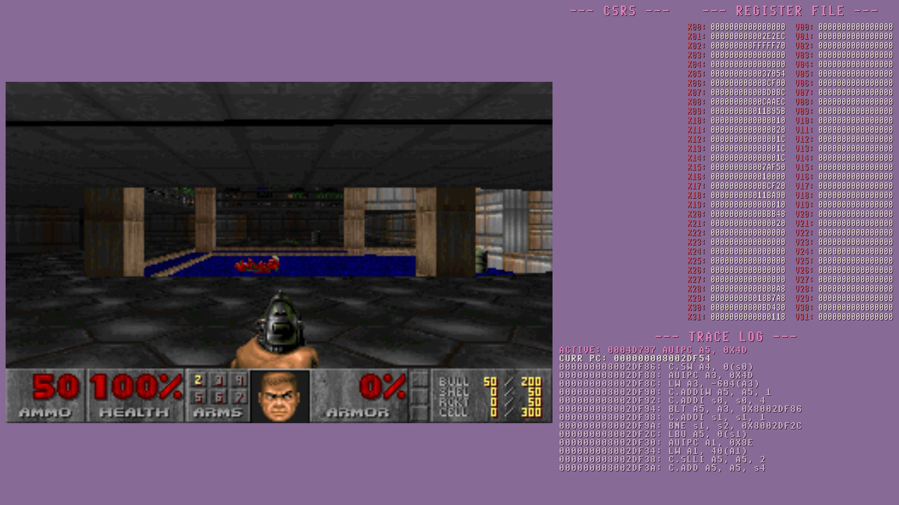
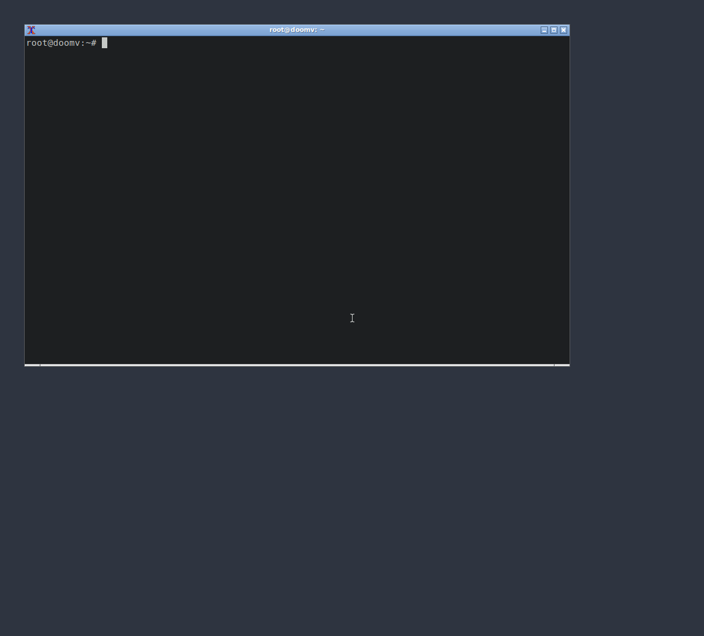
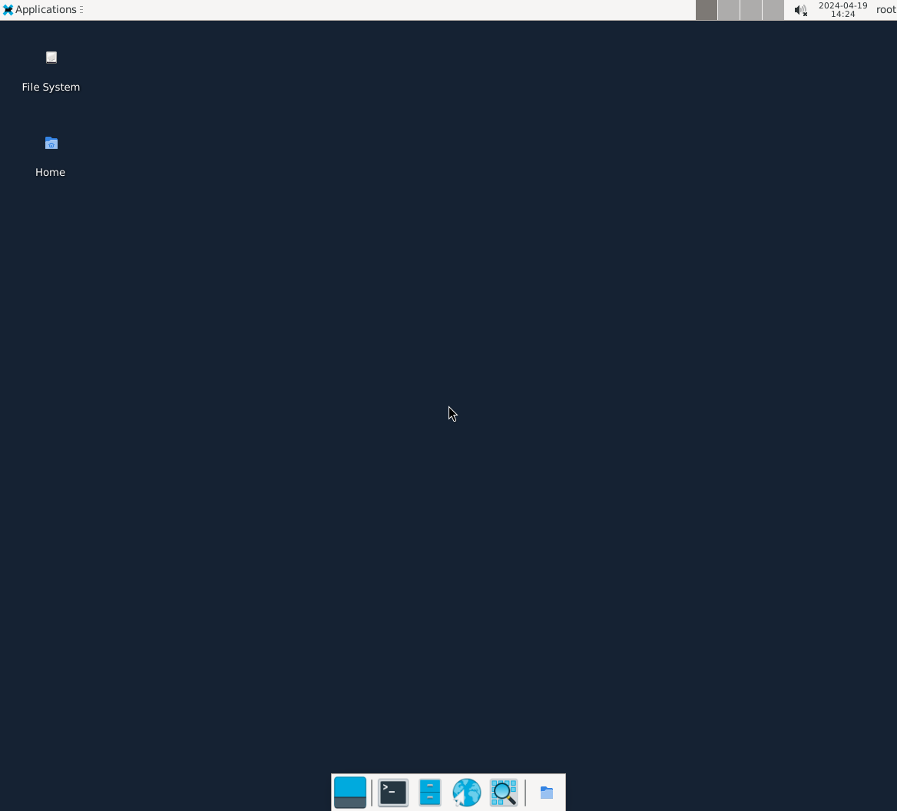
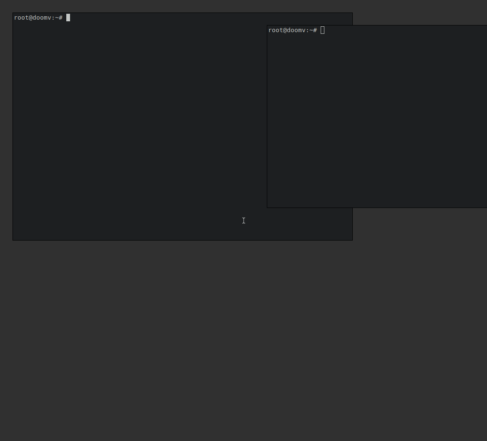
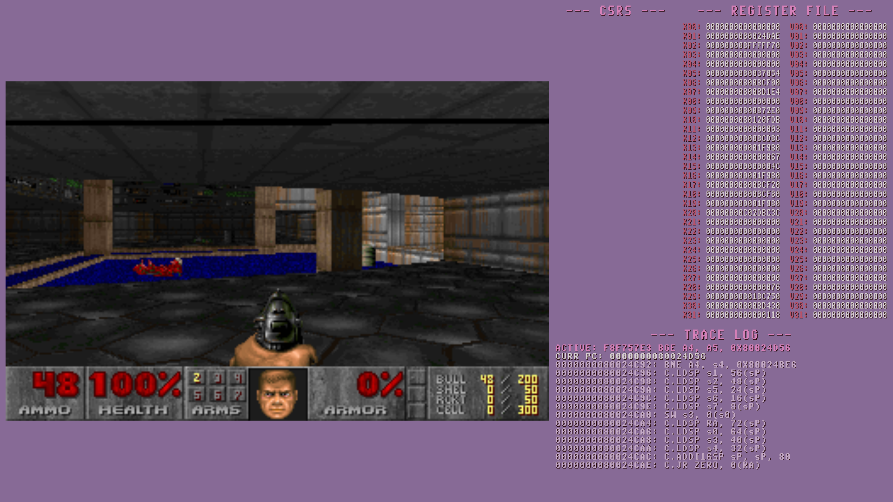
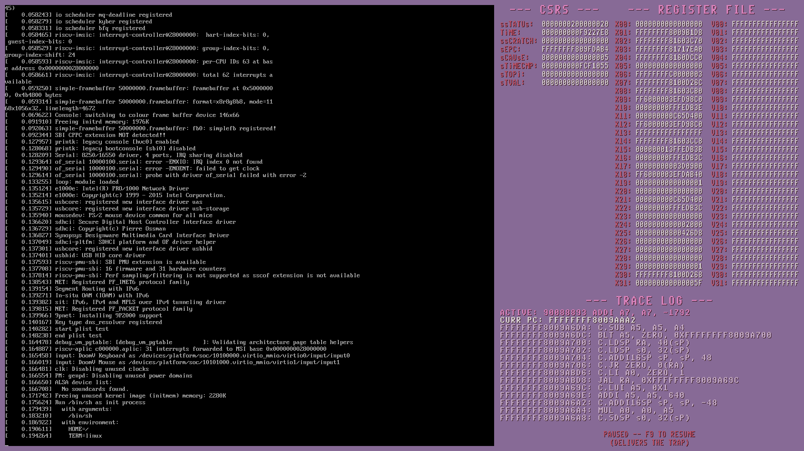

# DoomV

A RISC-V CPU, built from scratch in C++, that started out booting bare-metal
DOOM and now boots OpenSBI, Linux, and Ubuntu 24.04 with a desktop.

No existing core as a reference implementation — just an instruction
decoder, a register file, a memory bus, and the RVA23S64 profile (RV64GCV
plus the extensions below, and H), with the handful of devices a
distribution needs on top: AIA interrupt controllers, a framebuffer, a
real-time clock, and virtio disks, keyboard and mouse, network card, sound
card, GPU (2D, or OpenGL and Vulkan through the host's GPU), and a 9P folder shared with Windows.



## Why

My Gameboy emulator was done, I'd taken a chunk of computer architecture
coursework by that point, and I had a month free before starting a co-op.
I wanted a project that would actually make me use that coursework instead
of just having sat through it, and "build a CPU and see if it can run Doom"
seemed like the right amount of stupid.

The original goal was small on purpose: get bare-metal DOOM booting, and if
it works, stop — nothing else needs to be implemented to call it done. That
happened a while ago. Everything past that point (F/D, C, V, formal
verification against a reference simulator, Linux, Ubuntu) is stuff I kept going on because
it was fun, not because the project needed it.

## What's actually implemented

With no `-march`, a bare-metal guest such as DOOM gets `RV64GC` plus `Zicsr`
and `Zifencei` — i.e. `RV64IMAFDC_Zicsr_Zifencei` — along with the
extensions below marked on by default. `V` (vector) and `H` stay opt-in
there, since Doom needs neither. A Linux boot with no `-march` gets the full
RVA23S64 profile instead, `V` included, because that is what the device
tree tells the kernel the hart has.

| Extension | Status |
|---|---|
| I (base integer) | ✅ |
| M (mul/div) | ✅ |
| A (atomics) | ✅ |
| C (compressed) | ✅ |
| F / D (single/double float) | ✅ |
| Zicsr | ✅ |
| Zifencei | ✅ (no-op — see below) |
| V (vector) | ✅ (on for Linux boots, opt-in otherwise) |
| Zba / Zbb / Zbs (bitmanip) | ✅ |
| Zcb (compressed bitmanip/mem) | ✅ |
| Zicond (conditional move) | ✅ |
| Zvbb / Zvbc (vector bitmanip, carry-less multiply) | ✅ |
| Zbc / Zbkb / Zbkx (scalar carry-less multiply, crypto bitmanip) | ✅ |
| Zkr (entropy source `seed`) | ✅ |
| Zvkned / Zvkg (vector AES, GCM/GMAC) | ✅ |
| Zvknha / Zvknhb (vector SHA-256 / SHA-512) | ✅ |
| Zvksed / Zvksh (vector SM4, SM3) | ✅ |
| Zicfilp / Zicfiss (landing pads, shadow stack) | ✅, off by default |
| Zihintpause / Zihintntl | ✅ (hints — retire without effect) |
| Zimop / Zcmop | ✅ (write zero to `rd`) |
| Zicbom / Zicbop | ✅ (no cache to manage — see below) |
| Zicboz (`cbo.zero`) | ✅ |
| Zawrs (`wrs.nto`/`wrs.sto`) | ✅ (retires immediately) |
| Zicntr (`cycle`/`time`/`instret`) | ✅ |
| Zihpm (`hpmcounter3-31`) | ✅ (read as zero) |
| Zfa (additional FP) | ✅ |
| Zfh / Zfhmin (half-precision arithmetic, converts) | ✅ |
| Zvfh / Zvfhmin (vector half arithmetic, converts) | ✅ |
| Zvfbfmin / Zvfbfwma (vector bf16 converts, widening FMA) | ✅ |
| Svinval (fine-grained TLB invalidation) | ✅ (flushes the whole TLB — see below) |
| Svnapot (64KB contiguous PTEs) | ✅ |
| Svpbmt (page-based memory types) | ✅ |

The bitmanip families and `Zicond` are on by default despite Doom never
emitting them: every modern riscv64 Linux userspace assumes them, so
defaulting them off would only manufacture illegal instructions.

The last three rows are the RVA23 extensions that are defined to do
nothing observable. Several of them were already retiring correctly
before they had names here, because they are encoded inside another
instruction's space in a way that discards the result — `pause` is a
`fence`, the `ntl.*` hints are `c.add` into `x0`, and `prefetch.*` are
`ori` into `x0`. Claiming them properly still matters: it lets `-march`
gate them and the dashboard name them, and `Zimop`/`Zcmop` carry one real
rule — they must write **zero** to `rd`, which is the guarantee that
makes those reserved encodings safe for a future extension to claim.
`Zicbom`'s cache-management ops are satisfied trivially by a machine with
no cache; what is *not* modelled is the `menvcfg`/`senvcfg` permission
layer that lets M-mode make them trap in S/U mode.

`Zicboz` is different from its Zicbom siblings — `cbo.zero` is a real
store, and the address is aligned *down* to the 64-byte block, so
`cbo.zero (base+8)` still zeroes from `base`.

The clock and the counters are Sail's, because the goal is to produce
Sail's trace. `mtime` advances once every two steps -- a trap or an
interrupt is a step, as an instruction is -- which is Sail's clock with its
configuration's `instructions_per_tick` of 2, and it is still counted in
instructions, so the timer is as deterministic as ever. `mcycle` counts
those ticks and `minstret` counts instructions that complete; each stops
under `mcountinhibit` and under the Smcntrpmf mode filters in `mcyclecfg`
and `minstretcfg`, and a write to `minstret` is not itself counted.
`cycle`, `time` and `instret` read them. `mhpmcounter3` through
`mhpmcounter31` are writable and count no events, as in Sail.

`wfi`, `wrs.nto` and `wrs.sto` wait, as Sail's do: the clock ticks while
the hart waits, for at most ten ticks, and the wait ends early when an
interrupt is pending and enabled, or for a `wrs` when there is no
reservation. A `wfi` that times out below M-mode traps if `mstatus.TW` (or
in a guest `hstatus.VTW`) says so, and a `wfi` from U-mode is illegal at
once. On a single hart nothing else can break a reservation, so a `wrs`
always ends: the timeout is what ends it.

Zfa is mostly not new arithmetic — it is arithmetic that differs from an
existing instruction only in a corner, which is what makes it worth testing
carefully. `fminm`/`fmaxm` return a canonical NaN when *either* operand is
NaN, where `FMIN`/`FMAX` return the other operand; `fleq`/`fltq` return the
same value as `FLE`/`FLT` for every input and differ only in which NaNs
raise invalid; and `fcvtmod.w.d` wraps modulo 2³² where every other
float-to-int conversion saturates. Adding it surfaced a latent bug in the
base F and D extensions, where `FMIN`/`FMAX`/`FEQ` raised invalid for a
quiet NaN when the spec reserves that for a signalling one — a documented
simplification that was harmless for results and wrong for flags, and that
the accrued-flags-only test could not see.

RVA23 mandates only `Zfhmin` and `Zvfhmin` — half precision *arithmetic*
is an expansion option — but the full `Zfh` and `Zvfh` are implemented
here anyway, so `fadd.h` and its vector twin are real instructions rather
than something software has to widen around. MinGW has no `_Float16` on
x86, so the conversions are hand-written integer code
(`src/extensions/ext_fp16.hpp`) and the arithmetic goes through Berkeley
SoftFloat's `f16` alongside F and D. Narrowing rounds exactly once from
the source significand: going double → float → half rounds twice, and a
value that is an exact midpoint in half but not in single rounds the
wrong way.

Carrying an f16 through the vector unit needed one trick worth naming.
`ext_v_fp.cpp` computes in `double` and converts at the edges, and the
obvious conversion canonicalises every NaN — which destroys the operand's
payload and quiets a signalling NaN before anything can raise invalid on
it. So a half NaN is smuggled through the double as `0x7FF8000000000000 |
bits`, where the low sixteen bits are the original encoding and the result
is still a NaN to everything in between.

Adding them surfaced two older gaps. `exec_v_fp` returned silently for
any SEW other than 32 or 64, so every vector FP instruction at `e16` was
a no-op; and the whole widening/narrowing half of VFUNARY0
(`vfwcvt.*`/`vfncvt.*`, 14 instructions) was ignored the same way. Both
are implemented now. Separately, float-to-integer conversions never
reported inexact: `collect_fflags()` reads MXCSR, but `std::llrint` on
this toolchain goes through x87, so the flag was dropped. It is now
decided from the values — a conversion is inexact exactly when its
result converts back to something different — which holds for every
rounding mode and does not depend on the host.

`Svnapot` and `Svpbmt` add no instructions — they give meaning to page
table entry bits that were previously ignored, so the only way to exercise
them is an actual page-table walk. `Svnapot`'s N bit makes the low four
bits of the physical page number come from the *virtual* address, so one
entry covers 64KB; an implementation that ignores it still translates, it
just aliases every address in the range onto the same page. `Svpbmt`'s
memory types are genuinely unobservable here — with no caches, PMA, NC and
IO behave alike — so what makes it real is what must *fault*: the reserved
type 3, and any nonzero type while `menvcfg.PBMTE` is clear, which is how
an OS probes for the extension. Bits 60:54 of a PTE are now checked as
reserved too; without that the other two would be meaningless.

`Svinval`'s `sinval.vma` flushes the TLB, and `sfence.w.inval` and
`sfence.inval.ir` retire without effect. The TLB (`src/mmu.hpp`) is small,
direct-mapped and only ever flushed wholesale — by `sfence.vma`,
`sinval.vma`, and writes to the CSRs a translation depends on — so a
finer-grained invalidation has nothing finer to aim at, and bracketing it
has nothing to batch.

CSR accesses are privilege-checked: writing a read-only CSR, or touching
one above the current privilege level, raises an illegal instruction, and
`cycle`/`time`/`instret` are gated in S- and U-mode by the
`mcounteren`/`scounteren` chain. The CSRs of extensions this hart does not
have -- Smrnmi's, Sdtrig's triggers, the debug-mode registers -- trap, as they
do in Sail. Other CSR *numbers* this machine gives no meaning to are still
readable and writable: OpenSBI detects hart features by reading a spread of
CSRs to see which trap, so making every unknown one illegal is a much larger
change than making privilege boundaries real.

Every extension is a runtime toggle, not a compile-time one — pass
`-march=rv64imafdc_zicsr_zifencei` (the default), add a `v` for vector
support, or trim it down to something like `rv32ima` if you want to see it
fail in more interesting ways. `-march` sets what the hart supports; `misa`
is writable within that, as in Sail, so a guest can clear a letter to turn
the extension off and set it again to turn it back on. `fence.i` is implemented as a genuine no-op
rather than being unsupported: there's no instruction cache here to
invalidate, since every fetch reads straight out of live guest memory, so
the correct emulation of "make sure instruction fetches see recent stores"
is to just not need to do anything.

<a id="vlen"></a>
**Vector length.** VLEN is 128 bits unless `-vlen` says otherwise: any power
of two up to 65536, the most the spec allows (`boot.py ... --vlen 512`). Every
hart has the same. `vlenb` reports it, and the guest takes it from there --
Linux sizes its vector state by it, and a Linux boot at 512 runs to its shell
as at 128. At 128 the registers live inside the hart's register file as they
always have, so snapshots taken before `-vlen` existed still restore; wider,
they are the hart's own storage, saved after the rest, and a snapshot records
its VLEN and is only restored at the same one. Each width is checked against
Sail at that width: the riscv-vector-tests come built for VLEN 128, 256 and
512, and Sail runs with its `vlen_exp` to match (see
[Live results](#live-results)).

## Correctness

"It draws pixels that look like Doom" is not a correctness bar, so this
is measured against the architecture instead of against itself.

**Sail is the golden reference.** The [Sail RISC-V model](https://github.com/riscv/sail-riscv)
is generated from the same source the architecture is defined in, rather
than being an independent reimplementation, and it is the only model
riscv-arch-test ships an RVA23S64 configuration for -- there is no spike
RVA23S64 config at all. spike is still run behind `--ref spike`, because an
independent implementation disagreeing is a signal even when it turns out
to be the one that is wrong, but it does not decide anything.

<a id="live-results"></a>
### Live results

| suite | what it is | result |
| --- | --- | --- |
| riscv-arch-test RVA23S64 | the certification suite, 663 tests, signature-diffed against Sail | **663 / 663** |
| differential | 19 hand-written suites, 639 cases, diffed against Sail | **19 / 19** |
| riscv-vector-tests | ~3040 generated V tests at each of VLEN 128, 256 and 512, signature-diffed against Sail at the same VLEN | **3042 / 3042, 3043 / 3043, 3043 / 3043** |
| riscv-tests | the Berkeley suite, 377 applicable of 667; also lock-stepped strictly and co-run against Spike, Whisper and QEMU ([Every simulator at once](#corun)) | **377 / 377** |
| damo-rv-priv-ats | hypervisor, the only H coverage that exists anywhere -- 43 groups | **43 / 43 groups** |
| Linux | OpenSBI + 6.12 + busybox, ext4 root over virtio-blk | boots to an interactive shell, in a 1168x1056 framebuffer console |
| Ubuntu 24.04 | 104 packages, configured by DoomV running Ubuntu's own `dpkg`, systemd as PID 1; 270 more for the desktops | boots, logs in at the framebuffer console, and starts Openbox, XFCE or bare X |
| DOOM | bare-metal, no OS | plays |

`riscv-vector-tests` is the suite that covers the vector ISA at the width
this machine implements, including the sub-profiles RVA23 leaves optional:
Zvfh, bf16, Zvbb/Zvbc, and the whole Zvk crypto family. arch-test does not
test any of them, which is why it read 663/663 through every bug in
[Part IX](docs/BUGS.md#part-ix). `riscv-tests` is mostly redundant with
arch-test but not entirely -- it is the only suite here that exercises
M-mode's illegal-instruction path directly, and that is where the last
failure anywhere in this project turned out to be: `mstatus.TSR` was
writable and never read, so an S-mode `SRET` returned when it should have
trapped.

The Ubuntu row is the one no conformance suite can stand in for. Nothing
about it is checked against a reference model -- it either configures a
hundred packages or it does not. Stage 1 unpacks the `.debs` on the host
with `debootstrap --foreign`, which executes no riscv64 code; stage 2 is
booted with `init=/doomv-stage2` and **DoomV** runs Ubuntu's own `dpkg`,
the maintainer scripts, and the perl and shell they fork. The usual way to
do that step is `qemu-user-static` and binfmt, which is deliberately not
what happens here: an emulator that boots Linux should be able to run the
distribution's own tooling, and if it cannot, that is a bug worth finding.
See [tools/linux/ubuntu/](tools/linux/ubuntu/README.md).

It also runs a desktop, installed the same way -- by DoomV running `apt`:

| Openbox | XFCE | bare X |
|---|---|---|
|  |  |  |

<sub>Captured from DoomV's 1168x1056 Linux framebuffer with `-fbdump`.</sub>

Every suite runs headless (`-ng`), which is what makes them practical to
run at all: arch-test's 663 tests take about 40 seconds and the 43-group
hypervisor suite about 10. Reproduce all of it with one command:

```sh
tools/verification/verify.sh          # build, then every suite
tools/verification/verify.sh --quick  # skip the two slow suites
tools/verification/verify.sh archtest # just one
```

First time only, to build the reference model and fetch the suites:

```sh
tools/verification/tests/archtest/setup.sh          # toolchain, Sail 0.13.1, act
tools/verification/tests/archtest/gen_reference.sh  # compile tests + Sail signatures
tools/verification/tests/suites/fetch.sh            # precompiled third-party suites
```

<a id="corun"></a>
### Every simulator at once

`tools/verification/corun.py` runs one bare-metal program on Sail, DoomV,
Spike, Whisper and QEMU at the same time, reads each one's trace into the same
steps -- program counter, instruction, whether it trapped, the x, f and v
registers it left and the bytes it stored -- and walks every one against
Sail's from the entry point. Where one first parts from Sail the report says
at which instruction, in what, and what each side had:

```
python tools/verification/corun.py build/hello.elf
python tools/verification/corun.py --suite riscv-tests              # all of them, with a summary
python tools/verification/corun.py --suite riscv-vector-tests-v256x64 rv64vadd_vv-0
```

DoomV is held to more than the others. Besides its trace it runs under
`-lockstep-strict` against Sail's, which compares every CSR, trap, interrupt
and the clock as well, and when that stops on a difference a snapshot of DoomV
is taken one instruction before the one that went wrong -- and checked, by
restoring it and seeing that its next instruction is that one. The report
prints the line that restores it; from there it can be stepped in the window's
debugger or with [gdb](#gdb).

Each simulator gets the same ISA (`--march`, by default the one the suites use
with Sail), less what it does not know, and the report lists what it was not
given; a vector length (`--vlen`) applies to all five. Over all 377
riscv-tests (the rv64 ones, the M- and S-mode ones and the hypervisor ones):

| | matches Sail | where it does not |
| --- | --- | --- |
| DoomV | 377 / 377, and 377 / 377 in strict lock-step | |
| Spike | 362 | it traps on misaligned loads and stores, which Sail's configuration does in hardware; an `sc.w` that fails where Sail's succeeds; `marchid`, `mtinst`, `tselect` |
| Whisper | 365 | given no H -- with H and only an ISA string it crashes -- so the hypervisor tests trap; `misa`, `marchid`, the counters |
| QEMU | 368 | `misa`, `marchid`, `minstret`, `mtval2`, `pmpaddr`'s width, `tselect`; and one test that rewrites its own code, where QEMU's log names the old instruction |

None of those is a bug in DoomV, and only the misaligned accesses and the
`sc.w` are behaviour rather than a register's value or a missing extension. What the co-run found in
DoomV, the first time it ran, is in [docs/BUGS.md](docs/BUGS.md#part-xv):
`GVA` after a fault in `hlv`/`hsv`, stores no trace had been comparing, and --
from the wider vector suites -- two vector floating-point bugs that had been
there at VLEN 128 all along.

Where each runs: Sail, Spike, Whisper and QEMU in WSL, DoomV on Windows.
Spike and Whisper are built under `/root/build` (`simulators/spike/build.sh`;
Whisper with `make` in a copy of `simulators/whisper/src`), and QEMU is
Ubuntu's `qemu-system-riscv`. Traces and a `report.json` per program are in
`build/corun/`.

### What that process actually found

148 bugs, written up individually in [docs/BUGS.md](docs/BUGS.md). A few
that say something about the method:

* **Floating point had to stop using the host FPU.** Three ordinary bugs
  took the D and F families from 103 failures to 78, and then it stopped
  moving -- because RMM (round-to-nearest-ties-away) has no x86 encoding at
  all and was being approximated by round-to-nearest-even, wrong on every
  exact tie, and because host exception flags are unreliable on this
  machine. F/D now compute in Berkeley SoftFloat, which is what spike uses
  and why Sail and spike agree with each other. 103 failures to zero.
* **The hand-written suites passed the whole time.** All 19 matched Sail
  while 123 certification tests failed. They never fed a signalling NaN to
  `fcvt.d.s`, never exercised RMM, never hit a tie. Where an established
  suite covers the ground, it is better evidence than anything written to
  match one's own implementation.
* **Linux was never actually booting.** "238 lines to /bin/sh" was the
  emulator halting on an illegal instruction, which looks identical to a
  clean boot because the log simply stops. Making illegal instructions trap
  exposed it: userspace issued a `vsetivli`, the hart correctly called it
  illegal because the device tree never mentioned V, and the kernel turned
  that into SIGILL and killed init.
* **Whole features were missing and nothing noticed.** PMP did not exist.
  `mstatus.MPRV`, `mstatus.SD`, `mstatus.TVM`, `hstatus.VTSR`/`VTVM`/`VTW`
  were defined bits that nothing consulted. Physical memory attributes were
  unchecked, so a page-table walk off the end of RAM read zeros, saw an
  invalid PTE, and reported a *page* fault where the architecture requires
  an *access* fault.

The harness lives in `tools/verification/`. `tests/differential/` is the
hand-written suites, `tests/archtest/` drives riscv-arch-test, and
`tests/suites/` runs the precompiled third-party suites.

## Performance

An interpreter, one instruction at a time, so that every instruction can be
lock-stepped against Sail. Within that, [performance/](performance/README.md)
measures and profiles it: `bench.py` runs a Linux boot or DOOM's demo to an
exact step count and records the run, with a sampling histogram of where the
host's time goes, and requires the run to end in the same `crash.log` as the
baseline -- the proof that an optimization changed speed and nothing else.
Caching the interrupt check, the instruction fetch and memory accesses took the
Linux boot from 10.5 to 46.9 MIPS and DOOM from 16.6 to 60.0;
`performance/pgo.py` builds with profile-guided optimization on top of that,
for 59.7 and 82.2.

## Code layout

```
src/
  main.cpp             entry point, CLI flags, wires everything together
  doom_system.*         top-level system: owns decoder, registers, memory, gui
  memory.*              guest RAM, WAD/ELF loader, MMIO bus (framebuffers, input, virtio devices)
  registers.*           x0-31, f0-31, v0-31, PC, CSRs, and the trace history ring
  extensions.*           the enabled-extension table + -march= parser
  riscv_decoder.*        instruction word -> decoded struct, extension gate, dispatch
  riscv_core.hpp          shared declarations for each extension's execute function
  extensions/            one file per extension (ext_i.cpp, ext_m.cpp, ext_v_*.cpp, ...)
  debugger.*             breakpoints, halt conditions, crash/signature dumps
  gdb_server.*           gdb's remote protocol over TCP: packets in, replies out
  gdb_target.cpp         what gdb asks for, answered on the CPU thread between instructions
  gui.*                  the SDL window, framebuffer scaling, and the debug dashboard
  uart.*                 8250-compatible serial, which is the SBI console
  rtc.*                  a Goldfish real-time clock, so the guest knows the date
  virtio/                one file per virtio device, over one shared transport:
    virtio_mmio.*          the MMIO transport and virtqueues every device uses
    virtio_blk.*           the root disk and the storage drives
    virtio_input.*         the keyboard and the mouse
    virtio_9p.*            a 9P2000.L file server for the shared folder
    virtio_net.*           the network card
    virtio_snd.*           the sound card
    virtio_gpu.*           the GPU: the display through Linux's DRM driver
    virtio_gpu_virgl.cpp   its 3D commands: OpenGL (virgl) and Vulkan (Venus)
    virgl_backend.*        virglrenderer and the WGL contexts it draws with
  net/usernet.*          user-mode NAT behind the network card
  audio/host_audio.*     the host's default speakers and microphone, behind the sound card
  timer.* aplic.* imsic.*  CLINT timer and the AIA interrupt controllers
  mmu.* pmp.*            Sv39/48/57 translation with a TLB, and the PMP
```

Each extension owns its own decode + execute logic in its own file under
`src/extensions/` — nothing shared gets fought over, and adding a new
extension (which happened more than once) never means touching a giant
switch statement that also handles six other things.

## Building & running

```
make
./riscv_doom.exe tools/doom/doombuild/DOOM1.WAD tools/doom/doombuild/doomv-free.elf
```

On a machine that has never built this before, install the host tools first —
`make`, a compiler, SDL2 and Python:

```
powershell -ExecutionPolicy Bypass -File scripts/install_dependencies.ps1
```

That is all `make` needs. Building a *guest* (Linux, or the Ubuntu kernel)
additionally needs the RISC-V cross-toolchain, which lives in WSL and is
installed separately — see [Scripts](#scripts).

### Which compiler

`make` builds with Clang when it can find one and GCC otherwise. Both are
fully supported, both pass the whole test suite, and the two builds are
identical in behaviour — they stop the benchmark workloads on the same
`crash.log` hash. Clang is preferred only because it is considerably faster on
this code: roughly 1.12x plain, and 1.25–1.31x with PGO and ThinLTO. The
measurements are in [performance/README.md](performance/README.md).

`install_dependencies.ps1` installs GCC, so a fresh checkout builds with GCC
and needs nothing else. To switch to Clang:

```
python scripts/get_clang.py
```

That unpacks llvm-mingw under `build/toolchains/`, which is the only place
`make` looks. It is pinned to the version the numbers were measured with and
both suites were run against. Nothing depends on it having been run.

`make` picks, in order: `CXX=` on the command line, the llvm-mingw under
`build/toolchains/`, a `clang++` on `PATH`, then `g++`. So:

```
make                      # Clang if it is there, GCC if not
make CXX=g++ CC=gcc       # force GCC even with a Clang unpacked
make clean
```

Under Clang the default build uses ThinLTO; under GCC it does not, because
GCC 8.1 cannot link this project with LTO at all.

Under Clang it is also profile-guided, once there is a profile. PGO on top of
ThinLTO is the fastest build there is, so it is the one that gets run:
`scripts/build.py` trains a profile the first time it has a guest to train on
(a few minutes -- it runs the benchmark workloads), keeps it as
`build/pgo/doomv.profdata`, and from then on every `make` uses it. Training
again is one command, worth running after changing the hot path; a profile
that has gone stale costs speed, never correctness:

```
python performance/pgo.py            # (re)train, then build with the new profile
make PROFILE=                        # build without it
```

Under GCC, `pgo.py` still builds a PGO binary, but its profile is tied to that
build and the next `make` is an ordinary one.

`DOOM1.WAD` (the shareware IWAD) is the only WAD checked into this repo —
it's free to redistribute. Point it at your own `DOOM.WAD`/`DOOM2.WAD` if
you own a copy, and rebuild the guest ELF from `tools/doom/doombuild/` to match.

<a id="paste"></a>
### Pasting into the guest

**Ctrl+Alt+V**, or **F8** on a Linux guest, types the host's clipboard into the
guest. It is a paste in the
sense that matters -- the text comes from the host and lands in the guest --
but the mechanism is the emulated keyboard, one character at a time, at the
pace an `-input` script types. Nothing runs inside the guest to receive it, so
it works the same at a login prompt, in a shell, in an X terminal and in
anything else that reads a keyboard.

Two keys for one thing, because a chord and a function key get taken by
different things, and having both means one is usually free. F8 is intercepted
here and never reaches the guest, so a Linux guest cannot use F8 for itself
while this is bound — that is the trade for a paste key that needs no modifier
to arrive. It is Linux-only, since pasting into DOOM is not a thing to want and
DOOM binds every function key.

Two things follow from it being typing rather than a clipboard transfer:

* **It goes at typing speed** -- deliberately. The keystrokes are read by a
  tty or an X client that has to keep up, and a burst arrives faster than
  either drains. A long paste takes a moment.
* **It is input like any other**, committed on an instruction count, so
  `-record` captures it and `-replay` reproduces it exactly. What it does not
  do is make the *timing* of your keypress reproducible: that is outside the
  machine, same as any other live typing (see [Determinism](scripts/README.md)).

Pasting while an `-input` script is running waits for the script to finish,
rather than interleaving two texts into one keyboard.

**The other direction is not supported.** Copying from the guest to the host
cannot be done this way: the selection lives inside the guest, and getting it
out needs something running in there to hand it over -- a clipboard agent of
the kind SPICE uses. Nothing like that is in the guest today.

<a id="the-gate"></a>
### The gate

Nothing reaches `origin` that has not passed every test. That is enforced on
the machine doing the pushing, by a `pre-push` hook:

```
python scripts/install_hooks.py
```

From then on `git push` runs `scripts/ci.py` first and refuses the push if
anything fails. The gate is the build, strict lock-step against Sail, and every
suite in `verify.py` — about thirteen minutes, nearly all of it the suites:

```
python scripts/ci.py            # the same thing, by hand
python scripts/ci.py --quick    # skip the two slowest suites
```

The hook is the whole mechanism, deliberately. Running this suite on a hosted
CI runner is not possible without rebuilding it: the reference signatures come
from the Sail model and the tests are built by the RISC-V cross-toolchain, both
of which live in WSL, and the Linux and Ubuntu suites need images measured in
gigabytes. Testing on the machine that already has all of that is both faster
and more honest than approximating it elsewhere.

Two things worth knowing about it:

* `git push --no-verify` skips the hook. It is git's own escape hatch and it is
  there on purpose — a README typo does not need thirteen minutes — but it is
  the only way past, so it is worth noticing when you reach for it.
* Hooks are not version-controlled. `core.hooksPath` points at `.githooks/` in
  the tree, so the hook that runs is always the committed one, but a fresh
  clone still has to run `install_hooks.py` once before any of this applies.

### Command-line options

```
riscv_doom.exe <wad> <elf> [options]                      # bare-metal / test ELF
riscv_doom.exe -opensbi=<f> -kernel=<f> -dtb=<f> -initrd=<f> [options]   # Linux
```

| Option | Meaning |
| --- | --- |
| `-ng` | Headless: no SDL window, and the process exits as soon as the guest stops. Aliases: `-nogui`, `-headless`, `--headless`. |
| `-ram=<size>` | Guest RAM, e.g. `-ram=8G`. Bytes, or a `K`/`M`/`G`/`T` suffix; any value works, not just round ones, and it is rounded up to a page. Default 1G, minimum 64M. The device tree's memory node is rewritten to match, so the guest is told what was actually allocated. A DOOM run is capped at 2028M — the WAD sits directly above RAM and the guest reads its address from a 32-bit register, so RAM has to end below 4GB; a Linux boot has no such limit. |
| `-march=<isa>` | Override the enabled extension set, e.g. `rv64imafdc_zicsr_zifencei`. Without it a Linux boot gets the full RVA23S64 profile and everything else gets the `rv64imafdc_zicsr` default. |
| `-break=<hex_pc>` | Halt and dump full CPU state when the pc reaches this address. |
| `-sig=<hex_begin>:<hex_end>` | Dump this memory range to `signature.log` on halt — how the arch-test harness pulls signatures. |
| `-tohost=<hex_addr>` | Stop when the guest stores a nonzero word to this address, and write the value to `tohost.log`. This is how every bare-metal RISC-V suite reports its verdict, and it is the only stop signal for suites that export no signature symbols. |
| `-opensbi=<path>` | OpenSBI firmware ELF (`fw_jump.elf`). Any of the four Linux options selects Linux-boot mode. |
| `-kernel=<path>` | Kernel `Image`. |
| `-dtb=<path>` | Flattened device tree. |
| `-initrd=<path>` | Initramfs cpio archive. Omit it when booting from `-disk=` -- with an initramfs present the kernel runs that and never mounts the disk. |
| `-disk=<path>` | Raw disk image for the virtio-blk device. A whole-device filesystem or a partitioned image both work; the kernel finds the partition table itself. |
| `-drives=<dir>` | Folder of `*.img` storage drives to attach after the root disk on a Linux boot, in name order. Defaults to `drives`; `-drives=` turns it off. See [Storage drives](#drives). |
| `-shared=<dir>` | Host folder served live to a Linux guest over virtio-9p, mount tag `shared`. Defaults to `shared`; `-shared=` turns it off. See [Shared folder](#shared). |
| `-fbdump=<path>` | Write the Linux framebuffer to this file as a binary PPM, with a non-black pixel count on stdout. Written when the run stops and periodically while it runs. |
| `-expect=<text>` | Hold the headless stdin feed until the guest's console prints this string. |
| `-input=<path>` | Replay a script of keyboard and mouse events into the guest. The only way to exercise the input devices without a window and a person -- see [Input](#input). |
| `-guidump=<path>` | Write the composed window -- dashboard included -- to this file as a binary PPM, every 60th frame. |
| `-stopat=<n>` | Stop after exactly `n` instructions and write the machine state to `crash.log`. Two runs of the same guest with the same inputs leave identical files -- see [Determinism](#determinism). |
| `-record=<path>` | Log every input the guest receives -- keys, pointer, serial bytes -- with the instruction it arrived at. |
| `-replay=<path>` | Deliver a `-record` log's input at exactly those instructions, and ignore the window, stdin and `-input`. Reproduces a recorded run instruction for instruction. |
| `-snapshotat=<n>` `-snapshot=<dir>` | Save the whole machine to `dir` as the run goes past instruction `n`, and carry on. See [Snapshots](#snapshots). |
| `-restore=<dir>` | Start from a snapshot instead of from reset. The rest of the command line must describe the same machine. |
| `-trace=<path>` | Write a trace of every instruction, register and CSR write, store and trap, in Sail's trace format. |
| `-lockstep=<path>` | Run against a reference trace -- Sail's, or an RTL simulation's -- and halt at the first record that does not match. See [Lock-stepping](#lockstep). |
| `-lockstep-strict` | With `-lockstep`, compare everything, counters, time and interrupt timing included, and take nothing from the reference. How DoomV is held to Sail. |
| `-net` | A network card, with user-mode NAT behind it: the guest reaches the internet through the host. See [Networking](#networking). |
| `-gpu` | A virtio-gpu for a Linux guest, in place of the simple framebuffer: the display, OpenGL (virgl) and Vulkan (Venus) on the host GPU, and the guest's Mesa picks what each program uses. See [GPU](#gpu). |
| `-snd` | A sound card, playing through the host's default output and recording from its default input. See [Sound](#sound). |
| `-all` | Every host device: `-net -gpu -snd`. |
| `-rtc=host` or `-rtc=<seconds>` | Where the guest's clock starts: the host's time, read once at start, or seconds since 1970. Without it, 2026-01-01, so a run repeats exactly. The boot scripts pass `host`. See [The clock](#clock). |
| `-vlen=<bits>` | The vector registers' width: a power of two from 128 (the default) to 65536. `vlenb` reads it, and Linux and its programs size their vectors from that. See [Vector length](#vlen). |
| `-gdb`, `-gdb=<port>`, `-gdb=<address>:<port>` | A gdb server, on 127.0.0.1:1234 unless given another port or address; the machine waits for gdb, halted before its first instruction. See [Debugging with gdb](#gdb). |
| `-harts=<n>` | A machine of `n` identical harts (default 1), each starting at the entry with `a0` = its hart id. They take turns a step at a time, so a run is as deterministic as with one. See [Several harts](#harts). |

`-ng` is what makes the conformance suites practical. With a window open a
finished test never exits on its own and has to be killed from outside, so
every test cost its full timeout whether it passed or not; headless, the
whole 663-test arch-test run takes about 40 seconds and the 43-group
hypervisor suite about 10.

<a id="ubuntu"></a>
### Running Ubuntu, with or without a desktop

Ubuntu boots from `ubuntu.img` in the repository root. Building that image
takes hours -- the second stage is DoomV running Ubuntu's own `dpkg` -- so it
is an input the scripts never build; [tools/linux/ubuntu](tools/linux/ubuntu/README.md)
has the steps.

```
python scripts/boot.py ubuntu                       # window; logs in as root by itself
python scripts/boot.py ubuntu --install-desktops    # once: DoomV installs the desktops (hours)
python scripts/boot.py ubuntu --desktop xfce        # boot into XFCE, Openbox (openbox) or bare X (x)
python scripts/boot.py ubuntu --desktop-snapshot    # the booted XFCE desktop, in seconds
```

A boot takes a few minutes before the login prompt, and a desktop about 25
minutes; the window stays black for a while first, which is normal.
`--desktop-snapshot` skips all of that by restoring a desktop that was booted
already (see [Loading the booted XFCE desktop](#loading-the-booted-xfce-desktop)).
The mouse and keyboard work as you would expect; Ctrl+Alt+G grabs the mouse
and Ctrl+Alt+F gives the guest the whole window. Every option is in
[scripts/README.md](scripts/README.md).

### Driving a guest from a pipe

A headless Linux boot reads host stdin into the UART, so a guest is
scriptable without a window:

```sh
printf 'mount -t proc proc /proc\necho o > /proc/sysrq-trigger\n' \
  | riscv_doom.exe -ng -expect='~ # ' \
      -opensbi=build/linux/fw_jump.elf -kernel=build/linux/Image \
      -dtb=build/linux/doomv.dtb -initrd=build/linux/initramfs.cpio
```

`-expect` is the part that is not optional. Anything typed at a guest before
its tty exists is read out of the UART by OpenSBI, handed to a console with
no line discipline yet, and dropped -- send at reset and the guest runs
`cho o > /proc/sysrq-trigger`. Waiting on a prompt the guest has actually
printed is the only correct fix; a delay is a guess that has to be
re-guessed every time the guest changes speed.

Newlines are translated to CR on the way in, because that is what pressing
return sends and `ICRNL` is what the guest's line discipline is expecting.
Feed a raw LF and the command is typed but never runs.

Bytes enter the UART on the CPU thread, when its 16-byte ring has room and
at an instruction count, never when the host happens to deliver them. So
stdin **redirected from a file** (`riscv_doom.exe ... < commands.txt`) is
read in full before the guest starts and produces the same run every time.
A pipe or a terminal is live -- what arrives, and when, is up to whatever is
on the other end -- so add `-record` to be able to reproduce it with
`-replay`.

Pick the needle carefully: it is matched against the raw byte stream, and a
guest's output is not plain text. systemd colourises unit names, so its
`Started getty@tty1.service` is really `Started \e[0;1;39mgetty@tty1.service`
and a needle spanning the space never matches -- the gate then waits
forever and the feed sends nothing, which looks exactly like input not
working. Something contiguous and unstyled, like a shell prompt or
`login:`, is the safe choice.

That example also ends the run: `sifive,test0` is in the device tree, so a
guest's poweroff reaches the emulator and the process exits 0. That matters
for anything unattended -- see
[tools/linux/ubuntu/](tools/linux/ubuntu/README.md), where the build is four
hours long and the alternative is watching it.

<a id="input"></a>
### Input

The window's keyboard and mouse reach the guest, and how depends on what is
running.

**Linux** gets two `virtio-input` devices, a keyboard and a mouse, at
`0x10100000` and `0x10101000`. They are real input devices: the keyboard
binds the VT layer's `kbd` handler, so the framebuffer console can be typed
at and logged into, and both appear as `/dev/input/event*` for anything that
wants to read them directly.

```
$ cat /proc/bus/input/devices
N: Name="DoomV Keyboard"
H: Handlers=sysrq kbd event0
B: EV=3
B: KEY=ffffffffffffffff fffffffffffffffe

N: Name="DoomV Mouse"
H: Handlers=mouse0 event1
B: EV=f
B: KEY=70000 0 0 0 0
B: REL=140
B: ABS=3
```

Two devices rather than one, because the driver registers one input device
per virtio device: a single device claiming both keys and relative motion is
classified as a mouse with a hundred buttons by everything downstream.

Keys are forwarded as **scancodes**, not characters. An evdev code names a
physical key and the guest applies its own keymap, exactly as on real
hardware -- translating from keysyms instead would apply the host's layout
and then let the guest apply a second one on top. Characters are a separate
path: the serial console on `hvc0` gets them from SDL's own text input,
which resolves layout, modifiers and dead keys, plus ANSI sequences for the
arrows and navigation block and control characters for Ctrl+letter. Both
devices are fed every event, because which one a guest is listening to
depends on its `console=` setting and this side cannot know.

The mouse is an **absolute** pointer, the way QEMU's tablet is: `ABS_X` and
`ABS_Y` in framebuffer pixels, 0-1167 by 0-1055, with only the wheels left
relative. So the guest's cursor sits exactly under the host pointer, and X
maps a coordinate to a pixel with no acceleration or scaling in between. A
relative mouse cannot promise that -- the guest integrates deltas under its
own acceleration, and the two cursors drift apart as soon as the host pointer
leaves the display.

The mouse belongs to the guest **only over its display**. Everywhere else in
the window is the dashboard, so motion there is not forwarded and neither is
a click; a button pressed over the display and released outside it still
sends its release, so the guest is never left holding it.

**DOOM** has no drivers, so it gets two MMIO registers instead:
`MMIO_MOUSE_MOVE` at `0x1000000C` (dx in bits 31-16, dy in 15-0, signed,
destructive read) and `MMIO_MOUSE_BTN` at `0x10000010` (held buttons). That
is a deliberately different shape from the key queue next door: DOOM reads
the mouse once a frame and wants "how far since I last asked", so movement
*merges* when a frame runs long instead of queueing behind it. The port
posts an `ev_mouse` from `DG_DrawFrame`, and DOOM's own `mousex`/`mousey`
path does the rest -- mouse look and menu navigation both work.

Three keys belong to the window rather than the guest:

| Key | |
| --- | --- |
| F9 | Resume from a debugger halt |
| Ctrl+Alt+G | Capture the mouse: fence the pointer inside the display area and hide it. DOOM also switches to deltas, so the view can keep turning. |
| Ctrl+Alt+F | Give a Linux framebuffer the whole window instead of the dashboard's display box |
| Ctrl+Alt+V | Paste the host's clipboard into the guest, by typing it on the emulated keyboard |
| F8 | The same paste. Linux guests only; the guest does not see F8 while this is bound. |

Ctrl+Alt rather than more function keys because a bare function key is not
free -- DOOM binds all twelve, so F10 and F11 would have cost it "quit game"
and the gamma control.

`-input=<path>` replays a script of events so none of this needs a person:

```
key 30 1        # a key down, evdev code for Linux, doomkeys.h code for DOOM
key 30 0
type echo hello # as press/release pairs, US layout
rel 40 -20      # relative movement (Linux: moves the absolute pointer by that much)
abs 600 500     # Linux: put the pointer on a framebuffer pixel
btn left 1
wheel 1
sleep 500       # 500 x 10,000 instructions: about half a host second
wait 2M         # two million instructions (k, M, G)
```

<a id="networking"></a>
### Networking

`-net` (or `boot.py linux --net`, `boot.py ubuntu --net`) gives the guest a
virtio-net card and a network behind it made of ordinary host sockets -- no
driver, no administrator, the same idea as QEMU's user-mode network. The
guest sees `10.0.2.15` (by DHCP), a gateway at `10.0.2.2` that is the host
itself, and a DNS server at `10.0.2.3` that asks the host's own. TCP, UDP,
DNS and ping all work; there is no port forwarding yet, so nothing outside
can connect in.

```
python scripts/boot.py linux --net          # then, at the shell: udhcpc -i eth0
python scripts/boot.py ubuntu --setup-network   # once, for an image made before this
python scripts/boot.py ubuntu --net         # DHCP at boot; apt works
python scripts/boot.py ubuntu --setup-browser   # once: NetSurf, w3m, curl, and a self-setting clock
```

After `--setup-browser`, boot a desktop with the network
(`boot.py ubuntu --net --desktop openbox`) and run
`netsurf https://en.wikipedia.org &` in its terminal, or `w3m <url>` in any
shell. NetSurf draws ordinary pages in a few seconds; it runs little
JavaScript, so web applications do not work. Firefox and Chromium are snap
packages on Ubuntu with no riscv64 build to install.

The network is outside the machine, like a keyboard: what arrives, and when,
is not repeatable by nature. So incoming frames enter the guest only at the
same instruction counts typed keys do, `-record` logs every one, and
`-replay` delivers them again with no network at all -- a recorded session
replays to the same machine state. Without `-net` the card is not there
(device id 0) and nothing changes. A snapshot keeps the card and the frames
in flight, not the connections.

<a id="gpu"></a>
### GPU

`-gpu` (`boot.py linux --gpu`, `boot.py ubuntu --gpu`) gives a Linux guest a
virtio-gpu with everything below at once -- the display, OpenGL and Vulkan --
and Ubuntu's Mesa decides, per program, what to use: `virgl` for OpenGL,
`venus` for Vulkan, software where neither applies. Its DRM driver runs the display: the console and X draw into
resources in guest memory and flush them to the screen, rather than into a
fixed aperture. DoomV takes the simple-framebuffer out of the device tree it
loads, so the GPU is the only display; the guest sees `virtio_gpudrmfb` as
`/dev/fb0`, and the desktops' X configuration works unchanged. Every command
completes inside the notify that sent it, so a run is as repeatable as
without. One scanout, the size of the window; no blob resources.

OpenGL makes it a 3D GPU as well. The guest's Mesa
driver -- `virgl`, in every Ubuntu -- sends Gallium command streams, and
[virglrenderer](https://gitlab.freedesktop.org/virgl/virglrenderer) runs them
as OpenGL on this computer's GPU: OpenGL 4.3 and OpenGL ES 3.2 in the guest.
virglrenderer is DoomV's own build, loaded only with `-gpu` --
`python scripts/get_venus.py` builds it into `build/venus/`, and the boot
scripts do so the first time it is asked for.

```
python scripts/boot.py ubuntu --gpu
# in the guest (apt install mesa-utils kmscube):
eglinfo -B -p surfaceless     # renderer: virgl (<your GPU>)
kmscube                       # a spinning cube, drawn by the host GPU
```

What the host GPU computes is outside the machine, like a network frame. So
in this mode every GPU command's result -- the response, and anything a
read-back writes into guest memory -- is an input: `-record` logs each, and
`-replay` hands them back with no GPU at all, to the same machine state.
The picture is read back from the host GPU into a buffer only the window and
`-fbdump` see.

Snapshots work with the GPU as long as no program in the guest is using
OpenGL or Vulkan: the host GPU's resources -- the console's and X's
framebuffers -- are saved with their contents and made again on a restore,
and so is the context the kernel keeps for them. A context a program has
given commands to, or anything of Venus's, holds state on the host GPU that
cannot be saved; a snapshot then is refused with a message saying so.

Vulkan comes with it: Mesa's Venus driver in the guest
sees `Virtio-GPU Venus (<your GPU>)`, and its commands run on the host GPU.
Venus normally runs on threads of its own, which read the guest's command
rings and write results into memory the guest shares, whenever they get to
it -- the guest would see GPU results at instructions that depend on host
timing. DoomV's build runs it with no threads at all
([tools/venus/](tools/venus/README.md)): the rings are run, the GPU waited
for and fences retired only at a notify or an input point, so all of that
lands at the same instruction on every run. Two runs doing the same GPU work
end in identical machine state. And what Venus and the GPU write into that
shared memory is an input like any other: at each of those points `-record`
logs the bytes that changed, and `-replay` puts them back with no GPU, to
the same machine state.

On the desktops, X itself runs on the GPU when there is one: the
`modesetting` driver with glamor, which gives programs DRI3, so an OpenGL
program in a window renders through virgl like any other. A Vulkan program
presents by copying its frames through the CPU (`MESA_VK_WSI_DEBUG=sw`, set
by the session): sharing a Vulkan image with X's OpenGL would need the host
to share GPU memory between the two APIs, which drivers on Windows do not.
Without `-gpu` the desktops draw into the framebuffer as before. An image
made before this needs `boot.py ubuntu --setup-gpu` once, which also installs
current Mesa drivers and `glxgears`, `vkcube` and `kmscube` to try.

```
python scripts/boot.py ubuntu --gpu           # builds tools/venus the first time
# in the guest (apt install mesa-vulkan-drivers vulkan-tools):
vulkaninfo --summary                          # Virtio-GPU Venus (<your GPU>)
```

<a id="sound"></a>
### Sound

`-snd` gives a Linux guest a virtio-snd card with one output and one input
stream, played through the host's default speakers and recorded from its
default microphone -- whatever Windows has selected. The boot scripts add it
for Linux and Ubuntu when given `--sound`. The microphone is opened only
while the guest records, and closed again after.

```
python scripts/boot.py ubuntu --setup-sound   # once: aplay, arecord, speaker-test
python scripts/boot.py ubuntu --sound         # then, in the guest:
speaker-test -c 2 -t wav -l 1                 #   play
arecord -d 5 a.wav && aplay a.wav             #   record, and play it back
```

The card takes 8- or 16-bit samples, mono or stereo, at 5.5 to 48 kHz; ALSA's
`plug` layer, which `aplay` and most programs go through, converts anything
else. A period of sound is returned to the guest when the host has played it,
and a recorded one when the host has captured it, so the guest runs at the
host sound card's pace, like real hardware. That timing comes from outside
the machine, so it is an input: periods finish only at the input points,
`-record` logs each (with the recorded samples), and `-replay` reproduces the
session exactly, with no sound device needed. A guest that runs slower than
real time can not keep a stream fed, and its sound breaks up.

<a id="clock"></a>
### The clock

The guest has a real-time clock -- a Goldfish RTC, the one QEMU's virt board
has, which Linux reads at boot to set the date. Without one the guest starts in
whatever year systemd was built, and apt and HTTPS refuse dates that far off.

Its time is the start date plus the emulated timer, never the host's clock
while running, so it cannot make a run unrepeatable. The start date is
2026-01-01 unless `-rtc` names one; `-rtc=host` takes the host's time once,
at start, as an input: `-record` logs it, `-replay` uses the logged one, and a
snapshot keeps it. The boot scripts pass `host` (`--clock fixed` for the
fixed date). The emulated timer runs slower than real time, so a long-running
guest falls behind; `--setup-browser` installs `systemd-timesyncd`, which
puts it right over the network.

<a id="drives"></a>
### Storage drives

Every `*.img` in `drives/` is attached to a Linux guest as another virtio
disk at boot -- `/dev/vdb` onwards after Ubuntu's root disk, `/dev/vda`
onwards in the BusyBox boot, in the order the names sort.

```sh
python scripts/mkdrive.py data 1G    # drives/data.img, formatted ext4, labelled "data"
python scripts/boot.py ubuntu
# in the guest:  mkdir -p /mnt/data && mount LABEL=data /mnt/data
```

The device tree always declares eight drive slots, after the input devices.
An empty slot reports virtio device ID 0, which Linux skips without a word,
so adding a drive is dropping a file in the folder -- no device tree change.
A read-only image file is attached read-only and the guest is told, so a
mount comes up read-only rather than failing on its first write. Details and
limits in [drives/README.md](drives/README.md).

<a id="shared"></a>
### Shared folder

`shared/` is shared live with a Linux guest: a file saved there from Windows
is visible in the guest immediately, and the other way round, with both
running. Inside the guest:

```sh
mkdir -p /mnt/shared
mount -t 9p -o trans=virtio,version=9p2000.L shared /mnt/shared
```

It is a virtio-9p device -- the mechanism QEMU's shared folders use -- with a
9P2000.L file server in the emulator answering the guest's v9fs requests
against the real directory. The kernel already has the client built in, so
nothing needed rebuilding. Windows has no owners, modes, symlinks or
case-sensitive names, so the guest sees an approximation: everything is
root's and writable, the read-only attribute clears the write bits, names
Windows cannot hold are refused rather than altered, and symlinks fail with
"Operation not supported". Links inside the folder that point outside it are
refused too. For a real Linux filesystem, use a drive instead. Details in
[shared/README.md](shared/README.md).

What the guest learns about the folder does not come from the host's clock
or disk either, so a run that uses it is as reproducible as one that does
not. A file the guest changes is timestamped with the guest's own time -- the
instruction count as nanoseconds from 2024-01-01 -- and that time is written
to the Windows file too. Inode numbers count up in the order the guest first
sees each file, listings are sorted by name, and `df` reports a fixed 1 TiB.

<a id="own-programs"></a>
<a id="snapshots"></a>
### Snapshots

A snapshot is the whole machine at one instruction, so that a boot that takes
minutes -- Ubuntu to its desktop -- is paid for once:

```
riscv_doom.exe <the usual machine> -snapshotat=3000000000 -snapshot=snap/booted
riscv_doom.exe <the same machine> -restore=snap/booted
```

The first saves the machine as it goes past instruction 3,000,000,000 and runs
on; the second starts from there. A restored run is the same run: carried on to
any later instruction, it leaves the same `crash.log`, RAM, framebuffers and
disk as a run that never stopped. `tools/verification/snapshot_check.py` checks
exactly that, on any `bench.py` workload.

- **Same machine.** `-restore` checks the RAM size, `-march`, `-vlen`, Linux or DOOM,
  which disks are attached and whether there is a shared folder, and says which
  one differs. The boot files still have to be given, since that is how the
  machine is put together, though what they loaded is replaced.
- **Disks.** Each attached image is copied into the snapshot, because the guest
  goes on writing to it. A restored machine runs on `disk.work.img` (and
  `driveN.work.img`) in the snapshot folder, a fresh copy made at every
  restore, so neither the snapshot nor the images you started with are
  changed. A 4 GB image makes a snapshot of about 4 GB and adds about ten seconds
  each way.
- **Not yet:** a snapshot is refused while the guest has files open on the
  shared folder. `-input` scripts start from their beginning after a restore;
  a `-replay` log carries on from the snapshot's instruction.

#### Loading the booted XFCE desktop

The quickest way to a desktop is a snapshot of one. Make it once -- about 25
minutes, and 4.4 GB in `build/desktop/xfce-100G`, most of it the disk image.
It needs an `ubuntu.img` with the desktops installed.

```
python performance/make_desktop_snapshot.py
python scripts/boot.py ubuntu --desktop-snapshot
```

After about 15 seconds -- copying the disk image -- the window shows the XFCE
desktop, logged in as root, and it is yours.

- **Each restore starts clean.** The session runs on a copy of the snapshot's
  disk, replaced at every restore, so neither the snapshot nor `ubuntu.img`
  changes. To keep a session, snapshot it: add `--snapshot DIR --snapshot-at
  STEP` with a step past 100,000,000,000, and next time `--restore DIR` with the
  same options. 1,000,000,000 steps is a few seconds of yours.
- **The machine is fixed.** The snapshot was made with default memory, one
  hart, no storage drives and no shared folder, and a restore checks that, so
  `--desktop-snapshot` takes none of those options.
- **Same build.** After an update that changes the snapshot layout, the
  restore says so; make a new one.

The same snapshot is the starting point of `bench.py`'s `desktop` workload.

<a id="gdb"></a>
### Debugging with gdb

`-gdb` turns DoomV into a gdb remote target. The machine starts halted, before
its first instruction, and waits on 127.0.0.1:1234:

```
riscv_doom.exe -ng <wad> prog.elf -gdb             # or a Linux boot, or -restore=<snapshot>
riscv64-unknown-elf-gdb prog.elf -ex "target remote :1234"
```

Breakpoints, `stepi`, `continue`, Ctrl-C, `info registers`, `x/` and `print`
all work. gdb sees:

- **Registers** by its RISC-V numbering, described to it in a target
  description: x0-x31 and pc, f0-f31, every CSR (`p $mstatus`, `p $satp`), the
  privilege level (`p $priv`), and v0-v31 at the machine's VLEN, as bytes,
  halfwords, words, doublewords or quadwords (`p $v8.w`). x, f, v and pc can be
  set; CSRs are read-only -- a CSR write has effects on translation and
  interrupts that the hart's own CSR instructions take care of.
- **Memory** as the hart sees it at that moment: virtual through `satp` in S
  or U mode (or through `vsatp`, for a guest whose G-stage is bare), physical in
  M-mode. The page walk is gdb's own and read-only, so looking never sets a
  page's accessed or dirty bit, and only RAM is reached: a device register can
  change when it is read.
- **Harts** as threads: `info threads`, `thread 3`. A step is one round, every
  hart one instruction.
- **`monitor steps`** prints the step count -- the number `-stopat` and
  `-snapshotat` take -- and **`monitor snapshot <dir>`** saves the machine
  there, for `-restore=<dir>` later.

Stopping, stepping and looking change nothing the guest can see. Inputs are
committed at instruction counts, not at host times, so a run under gdb that
only breaks, steps and reads is the same run as one without it: stopped at a
breakpoint, single-stepped, snapshotted from gdb and continued to
`-stopat=400`, a riscv-tests program left a `crash.log` identical to the run
without gdb. Writing a register or memory from gdb is an input like any other,
and the run is then yours.

When the program ends -- `-tohost`, a poweroff, `-stopat` -- gdb is told it
exited. `kill` ends DoomV. A gdb in WSL cannot reach Windows' 127.0.0.1;
`-gdb=<address>:1234` listens on another of this computer's addresses
instead, such as the one WSL reaches Windows by (`ip route` in WSL names it),
if the firewall lets WSL in.

### Running your own programs in the guest

The Ubuntu guest is a normal riscv64 Linux, so anything built for riscv64
Linux runs on it. Building *in* the guest works but is slow — it is an emulated
hart — so cross-compile on the host and hand the binary over through
`shared/`.

The cross-compiler lives in WSL, where the rest of the guest toolchain already
is:

```sh
wsl -d Ubuntu -u root -- apt-get install -y gcc-riscv64-linux-gnu g++-riscv64-linux-gnu
```

Build **statically**. The guest has its own glibc and yours is not it; a static
binary sidesteps the whole question:

```sh
riscv64-linux-gnu-gcc -O2 -static -march=rv64gc hello.c -o hello
```

For a CMake project, point it at the cross-compiler and turn off anything that
assumes the build machine is the target:

```sh
cmake -B build-riscv \
  -DCMAKE_SYSTEM_NAME=Linux -DCMAKE_SYSTEM_PROCESSOR=riscv64 \
  -DCMAKE_C_COMPILER=riscv64-linux-gnu-gcc \
  -DCMAKE_CXX_COMPILER=riscv64-linux-gnu-g++ \
  -DCMAKE_BUILD_TYPE=Release \
  -DCMAKE_C_FLAGS="-march=rv64gc" -DCMAKE_CXX_FLAGS="-march=rv64gc" \
  -DCMAKE_EXE_LINKER_FLAGS="-static"
cmake --build build-riscv -j
riscv64-linux-gnu-strip -o shared/myprogram build-riscv/myprogram
```

Then boot with the folder attached and, in the guest:

```sh
mkdir -p /mnt/shared
mount -t 9p -o trans=virtio,version=9p2000.L shared /mnt/shared
cp /mnt/shared/myprogram /root/ && chmod +x /root/myprogram
/root/myprogram
```

The copy and the `chmod` are not optional. Windows has no execute bit, so
everything on the share arrives `-rw-rw-rw-` and running it in place gives
`Permission denied`. Data files are fine to read where they are — only the
program needs moving. Give the guest room with `--ram` if it needs it; see
[Building & running](#building--running).

Three things that go wrong first:

* **A static link fails on a library that is only shipped shared.** OpenMP is
  the usual one: `libgomp` has no static cross build here, so turn the feature
  off (`-DGGML_OPENMP=OFF` and equivalents) rather than falling back to dynamic
  linking.
* **`-march=native` or an autodetected ISA.** The host is x86; set
  `-march=rv64gc` and switch off any "detect the CPU" option. The guest
  supports far more than that — see [What's actually implemented](#whats-actually-implemented)
  — so raise the baseline deliberately if you want it, including vector.
* **Wall-clock assumptions.** The guest's clock comes from the instruction
  count, so a program that measures its own throughput will report a number
  about the emulated machine, not your CPU.

Worked example, and a reasonable test of all of the above:
[tools/llama/](tools/llama/README.md) cross-compiles llama.cpp and runs a GGUF
model from the share inside the guest — `bash tools/llama/build.sh` for the
binary, and `bash tools/llama/run.sh <model.gguf>` to boot, run it and power
off unattended. A
0.8B Qwen at IQ2_XXS generates on `--ram 4G`, slowly.

<a id="the-display"></a>
### The display

There are two framebuffers, and which one the window shows depends on how
the machine was started.

Both are shown the same way. The guest's display sits on the left, and one
column beside it holds the CSRs, the register file, the trace log and the
paused banner, with the same margin all the way round the window. The CSR
panel lists the ten CSRs the guest has used most across its last 1024 CSR
instructions, so it shows what the machine is doing now rather than
everything it ever touched.

<p align="center">
  
  
</p>
<p align="center"><sub>Left: DOOM. Right: Linux 6.12's boot log on the framebuffer console, stopped at a breakpoint, which is what the banner under the trace log is for.</sub></p>

Three threads besides the CPU's draw the window, and none of them waits for
another:

* **The display thread** takes whole frames out of the guest's framebuffer.
  Neither framebuffer can say "this frame is done" -- `simple-framebuffer`
  has no page flip and DOOM's is written in place -- but a frame is drawn in
  one burst of writes and then the guest goes and does something else. So
  the thread waits until the writes have stopped for 12 ms, copies, and
  throws the copy away if a write landed while it was copying. The window
  shows finished frames, not the next one being drawn a band at a time. A
  guest that draws for half a second without pausing gets that frame shown
  as it stands, so the picture never freezes.
* **The dashboard thread** draws the CSRs, register file and trace log into
  a layer of their own, from a small register snapshot the CPU thread
  publishes after every burst. The snapshot no longer carries any pixels.
* **The window thread** owns SDL. It polls input and composites the two
  layers when one of them has changed, paced by VSYNC.

DOOM writes its native 320x200 through `MMIO_FB`, and the window scales it
up to fill the display area while keeping its shape.

A Linux guest gets a 1168x1056 linear aperture at `0x50000000`, declared to
the kernel as a `simple-framebuffer` node in the device tree. The kernel's
`simplefb` driver binds to it and `fbcon` draws a 146x66 character console
into it, which the window shows at exactly 1:1 -- unscaled, so every glyph
on it is exactly the kernel's. The display area is that size for every
guest, which is why DOOM's is too.

That layout is drawn in real pixels and needs a 1920x1080 window. Below
that the dashboard falls back to an older, scaled layout, with the display
letterboxed into a smaller box. **Ctrl+Alt+F** hands a Linux framebuffer the
whole window in either case.

The aperture sits deliberately *outside* the device tree's memory node,
which is what stops Linux allocating over it without needing a
reserved-memory entry -- the same arrangement a carved-out framebuffer has
on real hardware. `simple-framebuffer` has no mode-setting protocol at all:
the driver takes width, height, stride and format from the device tree and
trusts them, so `tools/linux/dts/doomv.dts` and `Memory::LFB_*` have to
agree and nothing checks that they do.

The bootargs carry `console=tty0 console=hvc0`, in that order. Both consoles
are registered, so the kernel log reaches the framebuffer *and* the SBI
serial the headless harnesses read. The order decides which becomes
`/dev/console` and the last one wins, so `hvc0` last puts the shell on the
serial where a script can drive it.

Key bindings live in `controls.json` if you want to remap them. The mouse is
not in there: DOOM's own `mousebfire`/`mousebforward` defaults apply, and
mouse look works because the port posts an `ev_mouse` and DOOM already had
everything downstream of that. Press Ctrl+Alt+G to grab the pointer first --
without that it stops at the edge of the display, which is a short distance
to turn in.

The guest side — the actual Doom binary that runs *on* this CPU — is built
separately in `tools/doom/doombuild/`: a cross-compiled `doomgeneric` with a
small platform layer (`doomgeneric_doomv.c`, `w_file_doomv.c`, a libc
shim) that talks to DoomV's MMIO instead of a real OS.

## Scripts

Everything is driven from `scripts/`; [scripts/README.md](scripts/README.md)
is the guide. The short version:

```powershell
powershell -ExecutionPolicy Bypass -File scripts/install_dependencies.ps1   # host tools
powershell -ExecutionPolicy Bypass -File scripts/toolchain.ps1               # RISC-V tools in WSL

python scripts/boot.py doom | linux | ubuntu    # build and boot a guest
python scripts/boot.py linux --harts 4 --ram 4G # options every guest takes
python scripts/boot.py ubuntu --help            # everything a guest takes
python scripts/verify.py                        # the regression suites
python scripts/install_hooks.py                 # the gate before every push
```

## Design notes

<a id="determinism"></a>
**Determinism.** The same guest with the same inputs executes the same
instructions in the same order on every run, whatever the host is doing.
Guest time is counted in instructions, not the wall clock, and every device
request -- a disk read, a 9P call, delivering a key -- completes, writes
guest memory and raises its interrupt on the CPU thread at the instruction
that asked for it. Nothing the guest can observe is left to host timing.

Everything the guest cannot observe runs elsewhere: the display, the
dashboard, console output (queued and written by a thread of its own), and
the periodic `-fbdump` refresh. `-stopat=<n>` is how that is checked: run the
same boot twice, or with two builds, and the `crash.log` files -- registers,
CSRs, the instruction count and the last 4096 instructions -- must be
identical byte for byte.

Input follows the same rule. Every key, pointer event and serial byte is
committed on the CPU thread at an instruction count that is a multiple of
4096, however it was produced. An `-input` script runs on that clock --
`sleep` is a fixed number of instructions, not host time -- and stdin from a
file is fed as the guest makes room for it, so both give the same run every
time. A person at the window, or a live pipe, decides what arrives outside
the machine; `-record` logs exactly what was committed and at which
instruction, and `-replay` commits it again at the same instructions, which
reproduces that session.

The shared folder is the last place the host could leak in, and it is
closed the same way: timestamps for anything the guest changes come from the
instruction count, inode numbers from the order the guest sees files, and
free space is a fixed figure. The folder's starting contents are an input,
like a disk image; given the same contents, the guest sees the same folder.

The outside world the guest can reach is handled as input too. The clock's
starting date is read once, before the first instruction. Network frames,
and the moments sound periods finish, arrive at the input points like keys,
and `-record` and `-replay` carry them. Without `-net` and `-snd`, and with
the clock's default start, a run depends on nothing outside the machine.

<a id="lockstep"></a>
**Lock-stepping against Sail.** That determinism is what makes DoomV
checkable one instruction at a time, and the reference it is held to is
**Sail**, the RISC-V model generated from the same source the architecture
is specified in. `-trace=<path>` writes DoomV's run in the trace format
`sail_riscv_sim` prints with `--trace-instr --trace-gpr --trace-fpr
--trace-vreg --trace-csr --trace-mem --trace-exception --trace-interrupt`:
a line per instruction, then a line per effect.

```
[36] [M]: 0x00000000800000E0 (0x30529073)
CSR mtvec (0x305) <- 0x00000000800000E8
[83] [U]: 0x00000000800001BC (0x00113023)
mem[W,0x0000000080002000] <- 0x00AA00AA00AA00AA
[37] [M]: 0x00000000800000E4 (0x74445073)
trapping from M to M to handle illegal-instruction
handling exc#illegal-instruction at priv M | tval=0x0000000074445073 | tval2=0x0000000000000000 | tinst=0x0000000000000000
CSR mcause (0x342) <- 0x0000000000000002
```

`-lockstep=<path>` runs DoomV against a reference trace in that format --
Sail's, or an RTL testbench's written the same way -- one record at a time.
It stops at the first record that differs, prints both records and the field,
writes `crash.log`, and exits 1 when headless:

```
lockstep: MISMATCH at reference line 177, after 56 matching records (instruction 57)
  CSR mideleg (0x303): reference 0x0000000000001444, DoomV 0x0000000000000444
  reference:
    [56] [M]: 0x000000008000012C (0x30305073) csrrwi x0, mideleg, 0x0     reset_vector+220
    CSR mideleg (0x303) <- 0x0000000000001444
  DoomV:
    [56] [M]: 0x000000008000012C (0x30305073)
    CSR mideleg (0x303) <- 0x0000000000000444
```

Compared, for an instruction that completes: privilege (with V), pc and
instruction bits; every register and CSR write, against DoomV's value after
it; every store, by physical address and value; and that DoomV wrote nothing
the reference did not. For a trap or an interrupt: the same cause, epc and
tval, and the same values in every CSR trap entry writes.

With `-lockstep-strict` that is everything: reads of the counters and the
time, pending-interrupt state, and interrupts, which DoomV has to take by
itself at the instruction the reference took them. Without it, lock-step is
lenient about what an implementation's own clock and devices decide, so an
RTL design with a different timer can still be stepped: those reads (`mip`,
`sip`, the `topi`/`topei` registers, the counters and the time), and loads
from anything that is not RAM, are taken from the reference, and interrupts
are taken exactly where the reference took them, never on DoomV's own. A log
in Spike's `--log-commits` format is also read, for a reference that only
produces that.

`tools/verification/lockstep_sail.py` does this for the riscv-tests: Sail
traces each test, and DoomV lock-steps against the trace, strictly. Sail runs
with the suites' `rva23s64.json` exactly as it is: the goal is to match Sail
deterministically, so DoomV is the one that has to be that hart -- 63 guest
external interrupt lines, vectored trap vectors, a writable `misa` -- and the
reference is never adjusted to fit it. The script also assembles and runs
`tools/verification/tests/lockstep/*.S`, hand-written tests for what the
riscv-tests leave alone: the clock, the counters, and `wfi` and `wrs` waits.

```sh
python tools/verification/lockstep_sail.py                  # every rv64 test
python tools/verification/lockstep_sail.py rv64mi-p-csr     # one
```

It found six differences on its first run that every conformance suite had
passed over -- see [Part XIII of the bug history](docs/BUGS.md#part-xiii).

<a id="harts"></a>
**Several harts.** `-harts=N` (or `boot.py linux --harts N`) makes a machine
of N identical harts, up to 4095, sharing one memory and one clock. Each has
its own registers, TLB and caches, its own `msip` and `mtimecmp` in the CLINT,
and its own IMSIC files (hart h's at `0x24000000`/`0x28000000 + h × 0x1000`).

The harts take turns, one step each per round, hart 0 first. The order never
depends on the host, so a multi-hart run repeats exactly, as a single-hart one
does. `mtime` advances per round at Sail's rate, and a `wfi` or `wrs` waits a
round at a time while the others run.

**Checked against Sail.** Sail models one hart, so
`tools/verification/simulators/sail/multihart` builds `sail_riscv_mh`: N copies
of the unchanged Sail model over one memory, in the same order, with a small
patch so one hart can reach another's CLINT registers. The multi-hart tests --
contended AMOs and LR/SC, interrupts between harts, per-hart timers, waits
woken by another hart -- lock-step strictly against it, on 2 to 256 harts:

```sh
python tools/verification/lockstep_sail.py --multihart              # 2 and 4 harts
python tools/verification/lockstep_sail.py --multihart --harts 16,64
```

**Linux.** `boot.py linux --harts N` makes the matching device tree
(`tools/linux/dts/smp.py`) and boots it. Linux has come up with every CPU on
8, 16, 32, 64 and 128 harts: 95 s, 4 minutes, 14 minutes, 37 minutes and
about two and a half hours. The kernel and OpenSBI are built for 4096 (see
[bug 172](docs/BUGS.md#bug172)), but past 64 the boot gets slow: until
OpenSBI is done, hart 0 gets one step in N while its device-tree work grows
with the cube of N.

Good to know: the fast loop is single-hart only, so several harts run a few
times slower per instruction; `crash.log` from `-stopat` lists every hart's pc;
and `DOOMV_WAITSKIP=0` turns off a shortcut for waiting harts, to check that a
run is the same without it.

The core dispatches on a plain switch statement rather than a table of
function pointers. I went in assuming function pointers would be the
"proper" approach, but it turns out projects like QEMU deliberately avoid
that pattern — indirect calls through a function pointer table are worse
for branch prediction than a switch the compiler can reason about and
group cases in. So the core is, structurally, uglier than I'd like and
faster than the elegant version would've been.

Atomics were implemented even though a single-hart bare-metal target never
strictly needs them, because toolchain-emitted code (and doomgeneric's own
init sequence) assumes they exist. In practice every load/store here is
already atomic by construction, so the A extension mostly just needed to
exist and decode correctly.

## Sources

- [riscv-card](https://github.com/jameslzhu/riscv-card) — the reference
  sheet I built the initial decoder off of.
- [knazarov/rve](https://git.knazarov.com/knazarov/rve/) — not code I
  read, but the project that first showed me what set of extensions I'd
  actually need to get something like this booting.
- [riscv-opcodes](https://github.com/riscv/riscv-opcodes) — the
  authoritative encoding tables the V extension was implemented from.
- [spike](https://github.com/riscv-software-src/riscv-isa-sim) and
  [riscv-arch-test](https://github.com/riscv-non-isa/riscv-arch-test) —
  the reference simulator and compliance suite used for verification.
