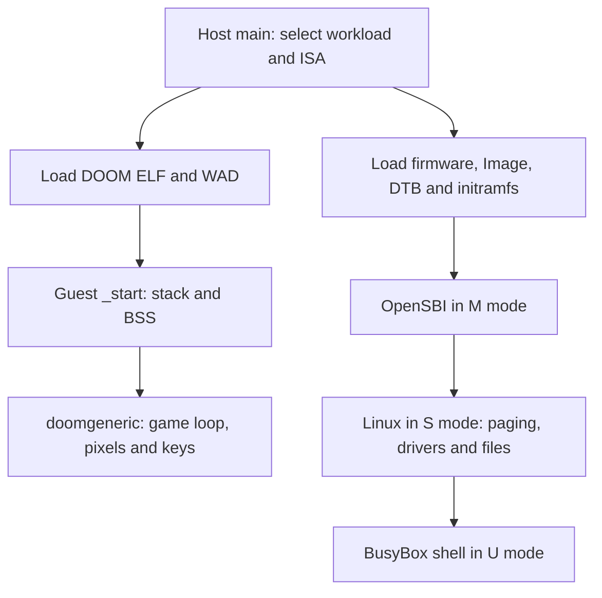

# How DoomV boots DOOM and Linux

Original inventory: `6b37ec0`. Boot entry, extension defaults and debugger
behavior rechecked at `c7d881b`. This guide explains source behavior; it does
not report a fresh successful boot.

[Documentation home](README.md) · [ISA reference](ISA_EXTENSIONS.md) · [Devices and architecture](DEVICES_AND_ARCHITECTURE.md)

DoomV supplies a machine; the guest supplies the program that runs on it.
For DOOM, that program owns the machine directly. For Linux, firmware first
prepares an environment in which a kernel can manage applications.

## The boot sequence at a glance



Both branches use the same C++ instruction interpreter. Loading an ELF does
not execute its functions on the host: DoomV reads guest instructions and
updates simulated registers and memory one operation at a time.

For a first read, follow the DOOM startup, then the Linux placement and handoff
sections. Use the diagnosis table after you know the last stage that worked.

## Contents

- [The boot sequence at a glance](#the-boot-sequence-at-a-glance)
- [Three addresses that must not be confused](#three-addresses-that-must-not-be-confused)
- [The firmware-to-kernel contract](#the-firmware-to-kernel-contract)
- [A console character, end to end](#a-console-character-end-to-end)
- [What counts as a successful boot](#what-counts-as-a-successful-boot)
- [Two boot paths](#two-boot-paths)
- [Build inputs and pinned dependencies](#build-inputs-and-pinned-dependencies)
- [Host startup and instruction execution](#host-startup-and-instruction-execution)
- [Bare-metal DOOM: build and launch](#bare-metal-doom-build-and-launch)
- [Bare-metal DOOM: ELF to C runtime](#bare-metal-doom-elf-to-c-runtime)
- [Bare-metal DOOM: engine initialization and main loop](#bare-metal-doom-engine-initialization-and-main-loop)
- [Bare-metal DOOM: replacing operating-system services](#bare-metal-doom-replacing-operating-system-services)
- [What DOOM actually requires](#what-doom-actually-requires)
- [Linux: build and launch](#linux-build-and-launch)
- [Linux: physical image placement](#linux-physical-image-placement)
- [What the device tree tells firmware and Linux](#what-the-device-tree-tells-firmware-and-linux)
- [OpenSBI: reset to supervisor handoff](#opensbi-reset-to-supervisor-handoff)
- [Linux: physical entry to virtual memory](#linux-physical-entry-to-virtual-memory)
- [Linux: interrupts timers and console](#linux-interrupts-timers-and-console)
- [Linux: initramfs to userspace shell](#linux-initramfs-to-userspace-shell)
- [What Linux adds beyond DOOM](#what-linux-adds-beyond-doom)
- [Diagnosing a boot that stops progressing](#diagnosing-a-boot-that-stops-progressing)
- [Evidence and scope](#evidence-and-scope)

## Two boot paths

The host program is a C++ RISC-V interpreter with an SDL interface. The guest is RISC-V code loaded into the interpreter's memory. A host function executes an instruction's semantics; it does not call the corresponding guest C function directly.

| Path | First guest code | Execution environment | Observable destination |
|---|---|---|---|
| Bare-metal doomgeneric | Project `_start` in its guest ELF | M-mode code, project MMIO and newlib shims | DOOM's framebuffer and input loop |
| OpenSBI/Linux | OpenSBI firmware at RAM base | M-mode firmware hands off to an S-mode kernel, then U-mode userspace | BusyBox `/bin/sh` through SBI console |

The standard DOOM path does not boot Linux or use OpenSBI. Linux is a separate workload selected by command-line options. This source does not supply a third path that starts the Linux kernel and then automatically runs DOOM inside it.

## Build inputs and pinned dependencies

The [root Makefile](../Makefile) builds the **host** `riscv_doom.exe`. It is configured for the project's Windows/MinGW environment, with SDL2, winpthread and static GCC/C++ runtime flags. `make` on an arbitrary Linux machine is not a documented portable build of that unchanged Makefile.

The host compiles Berkeley SoftFloat C files from the pinned Spike submodule and links them into the C++ executable. Spike is therefore a source dependency of the host's FP implementation, not merely an optional comparison program. The first-party config is [src/softfloat/config.h](../src/softfloat/config.h).

| Dependency | Pinned commit in this snapshot | Why it matters |
|---|---|---|
| doomgeneric | `dcb7a8dbc7a16ce3dda29382ac9aae9d77d21284` | Engine C sources linked with DoomV's platform files |
| OpenSBI | `2552799a1df30a3dcd2321a8b75d61d06f5fb9fc` | Firmware used by the separate Linux path; repository notes identify v1.3 |
| Linux | `adc218676eef25575469234709c2d87185ca223a` | Kernel source; repository notes identify v6.12 |
| BusyBox | `1a64f6a20aaf6ea4dbba68bbfa8cc1ab7e5c57c4` | Statically linked shell and applets in initramfs |
| Spike | `231e0d535d371eed4a7f5781d82ea0a8b96bdae2` | SoftFloat sources plus optional verification simulator |

Initialize the relevant submodules in an ordinary repository checkout before building:

```sh
git submodule update --init tools/doom/doombuild/doomgeneric
git submodule update --init tools/verification/simulators/spike/src
make
```

For the Linux path, also obtain the pinned firmware, kernel and BusyBox source. The existing [kernel guide](../tools/linux/linux/README.md) explains why Linux builds and checkout should happen inside WSL/Linux rather than directly on a Windows filesystem. Treat build commands here as instructions derived from source, not commands newly executed during this documentation task.

## Host startup and instruction execution

1. [main.cpp](../src/main.cpp) parses positional WAD/ELF arguments and optional `-march`, `-break`, `-sig`, `-opensbi`, `-kernel`, `-dtb`, `-initrd` flags.
2. `parse_march` runs only if explicitly requested. Omitting it preserves the broad `ExtensionConfig` defaults; passing a string can disable features the default enables. The parser is not a profile validator.
3. Constructing `DoomSystem` constructs registers, memory, core and decoder. Registers start in M mode with virtualization false. Integer/FP/vector storage and generic CSRs are zeroed; `vtype.vill` starts set and `vl=0`.
4. The selected initialization routine creates the SDL GUI and loads guest data. The host supplies a starting PC; it does not run a hardware ROM reset vector first.
5. `run()` starts a detached CPU thread. The original thread polls SDL input and renders snapshots. The CPU performs bursts of up to 200,000 `step()` calls before publishing a snapshot.
6. Each step first tests pending enabled interrupts. If one is taken, trap entry redirects PC and the step advances the modeled timer without executing the instruction formerly at PC.
7. Otherwise, the host checks PC breakpoints, translates the instruction address and fetches the first 16 bits. If those bits describe a 32-bit instruction, it translates and fetches the next halfword separately. This matters at page/PMP boundaries.
8. The decoder identifies the extension and fields, checks configuration/state, then calls its execution handler. A cache keyed by PC **and current raw bytes** avoids repeated decode work without using stale self-modified instructions.
9. The handler changes registers/memory and selects the next PC, or enters a trap. History and timing are updated, and a later snapshot exposes the result to the GUI.

The [system implementation](../src/doom_system.cpp) calls `step_instructions` for interrupt and fault paths too. Therefore the shared timer/counter value is a count of modeled progress steps, not an exact count of successfully retired architectural instructions. GUI frames, guest frames and CPU steps are three different quantities.

## Bare-metal DOOM: build and launch

In the configured host build environment, with `riscv-none-elf-gcc` and newlib available:

```sh
make -C tools/doom/doombuild free
./riscv_doom.exe tools/doom/doombuild/DOOM1.WAD tools/doom/doombuild/doomv-free.elf
```

The [guest Makefile](../tools/doom/doombuild/Makefile) uses `rv64imac_zicsr`, `lp64` and `medany`. This is an integer ABI; floating-point hardware is not required just because the host can emulate it. `medany` permits PC-relative references for code/data placed at `0x80000000`, where the previous absolute `medlow` assumptions caused relocation failures.

Resolution is passed globally as `DOOMGENERIC_RESX=320` and `DOOMGENERIC_RESY=200`. The engine allocation, its renderer and the platform copy loop must agree. Defining these only in a platform header would not affect engine files that never include it.

`make free XLEN=32` selects the RV32 toolchain ABI. Launch its newly built ELF with `-march=rv32imac_zicsr`; ELF width selection follows the runtime flag. Output names do not automatically distinguish XLEN, so keep the binary and launch configuration together. This describes the explicit RV32 path, not a fresh verification of every optional RV32 extension.

## Bare-metal DOOM: ELF to C runtime

`DoomSystem::init` reads the WAD file and copies it to `0x90000000`, then calls `Memory::load_elf` for the executable. The [ELF loader](../src/memory.cpp) uses ELF32 or ELF64 structures according to XLEN, reads PT_LOAD program headers, copies file bytes into the backing allocation using **p_vaddr**, and clears the p_memsz−p_filesz tail. It does not implement dynamic linking or Linux process loading.

Initialization sets PC to `Memory::RAM_BASE`, **not to the ELF e_entry field**. Consequently the placement of `.text.start` in the [linker script](../tools/doom/doombuild/riscv.lds) is part of the loader contract, even though the script also declares `ENTRY(_start)`.

| Region/symbol | Role |
|---|---|
| `.text.start` at `0x80000000` | First guest instructions |
| `.text`, `.rodata`, `.srodata` | Executable code and constants |
| `.data`, `.sdata` | Initialized globals supplied by ELF loading |
| `_sbss` … `_ebss` | Zero-initialized globals, including `.sbss*`, `.scommon` and COMMON |
| `end`, `_end`, `_heap_start` | Start of heap after all static data |
| `__stacktop = 0x90000000` | Initial stack pointer at top of RAM; stack grows downward |
| WAD window beginning at `0x90000000` | Asset bytes beyond RAM, separate from the linked image |

The guest [start.S](../tools/doom/doombuild/start.S) loads sp, clears BSS in four-byte stores and calls `main`. ELF loading already clears segment tails, but explicit BSS initialization also expresses the guest startup contract. If `main` returns, `_exit` loops forever.

The heap grows upward from `end`; the stack grows downward from RAM top. `_sbrk` bounds growth at WAD_BASE, but does not reserve a separate stack region or detect a live heap/stack collision. The presence of a 256-MiB region is not a memory-allocation safety guarantee.

## Bare-metal DOOM: engine initialization and main loop

The project [platform main](../tools/doom/doombuild/doomgeneric_doomv.c) supplies `{"doomv", "-iwad", IWAD_NAME}` to `doomgeneric_Create`, then repeatedly calls `doomgeneric_Tick`.

In the [pinned doomgeneric entry source](https://github.com/ozkl/doomgeneric/blob/dcb7a8dbc7a16ce3dda29382ac9aae9d77d21284/doomgeneric/doomgeneric.c), creation saves arguments, handles response-file processing, allocates `DG_ScreenBuffer`, calls `DG_Init` and enters `D_DoomMain` initialization. DoomV's `DG_Init` is empty because the host GUI already exists. Thereafter engine ticking performs game work and uses the DG platform callbacks when it needs time, input or display.

`DG_DrawFrame` writes every 32-bit pixel in `DG_ScreenBuffer` to the memory-mapped framebuffer. Those guest stores are interpreted like other stores until physical bus dispatch reaches the framebuffer region. The host copies framebuffer bytes into a snapshot; SDL renders that snapshot. There is no simulated GPU running the DOOM renderer: the guest CPU computes pixels and the host displays them.

Input travels the opposite way. SDL key events are translated to DOOM codes and queued by the host. `DG_GetKey` reads the MMIO input word, which pops one event. Bits 15:8 carry pressed/released state and bits 7:0 the key code. A zero result means no event.

## Bare-metal DOOM: replacing operating-system services

| Service | Guest implementation | Host/platform effect |
|---|---|---|
| Time | `DG_GetTicksMs` | Read `0x10000004`; advances once per 1,200 modeled steps |
| Sleep | `DG_SleepMs` | Guest busy loop until unsigned tick difference reaches requested delay |
| Graphics | `DG_DrawFrame` | Store 320×200 32-bit pixels at `0x10001000` |
| Keys | `DG_GetKey` | Pop word at `0x10000000` |
| Debug text | `_write` | Write bytes to `0x10000008`; host prints/flushed stdout |
| Memory allocation | newlib malloc calls project `_sbrk` | Grow guest heap within the backing RAM limit |
| IWAD discovery | `_open`, `_read`, `_lseek`, `_close` | One read-only named file, fd 3, mapped to WAD bytes |
| WAD lump reads | Project `W_OpenFile`/`W_Read` | Direct memory-backed asset access with declared WAD length |

The two WAD paths are deliberately distinct. The engine first asks whether a named IWAD exists, through libc `fopen` and `_open`. Only later does its WAD backend use `W_OpenFile`. Making the latter work does not make file discovery work. The shim serves only the expected read-only name so missing config files still fail normally.

The [WAD backend](../tools/doom/doombuild/w_file_doomv.c) points a static `wad_file_t` at WAD_BASE and caps reads at compile-time `WAD_LENGTH`. The Makefile selects a hardcoded length constant for each WAD target; it does not measure the runtime file. Replacing the runtime WAD without rebuilding the associated guest metadata can make the length disagree.

The [libc shim](../tools/doom/doombuild/libc_shim.c) is not a filesystem or an operating system. Most unsupported operations fail; `mkdir` returns ENOSYS. `-nostartfiles` removes default startup objects, while `nosys.specs` retains useful newlib routines with syscall stubs/overrides. `_write` prevents guest diagnostics from disappearing into the default always-fail stub.

## What DOOM actually requires

The supplied guest targets I/M/A/C/Zicsr, RAM, a working ELF/startup contract, a heap, WAD reads and the custom display/input/time interface. Its compiler flags determine emitted instructions; a source-level game feature does not necessarily correspond to an ISA extension.

It does not require page tables, a scheduler, system-call dispatch, OpenSBI, external interrupts, APLIC/IMSIC, H or V. It uses a busy loop for delay because it owns its CPU execution environment. It also does not need hardware F/D merely because source code might contain floating expressions: its selected toolchain ABI and compilation determine how such code is implemented.

## Linux: build and launch

The firmware [build script](../tools/linux/opensbi/build.sh) builds the generic OpenSBI platform using `riscv-none-elf-`, RV64 IMAFDC/Zicsr/Zifencei and lp64d. It locally adjusts the pinned Makefile for GNU C11 and a Windows archive-command-length issue, then restores that Makefile with an EXIT trap. These are existing build-script actions; this documentation change does not execute or modify them.

```sh
git submodule update --init tools/linux/opensbi/src
bash tools/linux/opensbi/build.sh
```

Follow the existing [Linux build guide](../tools/linux/linux/README.md) and [BusyBox guide](../tools/linux/rootfs/README.md) for the Linux/WSL cross-build. Necessary console settings described there include `CONFIG_RISCV_SBI_V01=y`, `CONFIG_NONPORTABLE=y` and `CONFIG_HVC_RISCV_SBI=y`; the latter must actually survive Kconfig dependency resolution. Build the `Image` target. Statically link BusyBox and pack the installed files into a `newc` cpio archive.

Compile the tree after checking its initrd end address against the actual archive length:

```sh
dtc -I dts -O dtb -o tools/linux/dts/doomv.dtb tools/linux/dts/doomv.dts
./riscv_doom.exe \
  -opensbi=tools/linux/opensbi/fw_jump.elf \
  -kernel=tools/linux/linux/Image \
  -dtb=tools/linux/dts/doomv.dtb \
  -initrd=tools/linux/rootfs/initramfs.cpio
```

Use the default runtime configuration with the supplied default DT. Adding a restrictive `-march` without adjusting DT extension claims can make the kernel use unsupported instructions. All four Linux-path options are required; there is no CLI mode for firmware-only boot in this main function. `vmlinux` is useful for symbols but the loader expects the raw `Image` in `-kernel`.

## Linux: physical image placement

`init_linux_boot` loads all four files before running any guest firmware. OpenSBI is not reading the kernel from a simulated disk.

| Artifact/state | Location/value | How it gets there |
|---|---|---|
| OpenSBI PT_LOAD segments | Starting around `0x80000000` according to ELF layout | `load_elf` |
| Kernel Image | `0x80200000` | Raw blob at RAM_BASE + `0x200000` |
| Compiled DTB | `0x82200000` | Raw blob at RAM_BASE + `0x2200000` |
| Initramfs | `0x82300000` | Raw blob at RAM_BASE + `0x2300000` |
| Initial PC | `0x80000000` | Set explicitly |
| a0 / x10 | 0 | Hart ID |
| a1 / x11 | `0x82200000` | DTB pointer |
| Initial privilege | M | Register reset state |

Firmware jump constants, host offsets, DTS memory ranges and rebuilt artifact sizes must agree. The loader checks the backing allocation boundary, but does not detect overlap between separately loaded blobs. In this source inventory the kernel Image is 24,220,160 bytes, smaller than the 32-MiB space to the DTB, and initramfs is 2,024,960 bytes. These are snapshot file sizes, not permanent maximums.

The DTS declares initrd start `0x82300000` and end `0x824ee600`, an exclusive end. Their difference is exactly 2,024,960 bytes. Rebuilding BusyBox may change that number; the host does not patch the DTB automatically.

## What the device tree tells firmware and Linux

A DTS is readable source. `dtc` compiles it into a DTB, a structured binary containing nodes and properties. FDT is the flattened device-tree representation and the name commonly used by firmware parsers. It is data describing hardware; it is not executable firmware or an MMU page table.

The [project DTS](../tools/linux/dts/doomv.dts) describes:

- One hart, ID 0, with an Sv39 MMU and a declared ISA list.
- RAM at `0x80000000`, size 256 MiB.
- The CLINT-compatible timer region and local interrupt numbers.
- Separate M and S IMSIC interrupt files and an APLIC whose MSI parent is the S file.
- A byte-spaced UART at `0x10000100`.
- A 1,000,000,000-Hz timebase and 64-byte cache-operation blocks.
- `/chosen` boot arguments, firmware console path and initrd bounds.

`compatible` selects a driver; `reg` supplies physical ranges. `interrupts-extended` connects a device to an interrupt controller and cause. A phandle such as `&imsic_s` is a reference between nodes; it does not create an actual wire in the C++ model. The backing device code must implement what the node advertises.

Linux may prefer `riscv,isa-base` plus `riscv,isa-extensions` over the older `riscv,isa` string. DoomV keeps both forms in the DTB and currently lists V in both, so Linux can enable vector state for userspace. H is not part of this normal Linux boot. The DTB is static: changing `-march` at launch does not rewrite its ISA claims, so a restricted runtime configuration can disagree with what Linux was told the hart supports.

## OpenSBI: reset to supervisor handoff

SBI is the supervisor binary interface: a calling convention by which an S-mode kernel asks M-mode firmware for services. OpenSBI is the firmware implementation of that interface. It executes real guest instructions in DoomV.

The [pinned fw_base.S](https://github.com/riscv-software-src/opensbi/blob/2552799a1df30a3dcd2321a8b75d61d06f5fb9fc/firmware/fw_base.S) establishes firmware startup state: relocation when required, BSS clearing, per-hart scratch/stack setup, platform information and trap-entry context, then calls `sbi_init`. Its cold/warm paths coordinate harts even though DoomV models only one.

The firmware discovers its platform through the FDT and CSR probing. For this platform that includes polling UART console, timer and M-file interrupt initialization. `misa` must report S support: a firmware selecting an S-mode next stage must know that mode exists. A readable CSR must also have credible WARL/alias behavior; arbitrary zero-filled storage can fool feature probing rather than implement a feature.

The [pinned fw_jump.S](https://github.com/riscv-software-src/opensbi/blob/2552799a1df30a3dcd2321a8b75d61d06f5fb9fc/firmware/fw_jump.S) supplies the next-stage address, argument and mode. This firmware variant uses build-time jump values; it does not parse a kernel filesystem. The expected handoff is to the already-loaded kernel at `0x80200000`, with hart ID and FDT pointer, in S mode.

The key architectural mechanism is programming next PC/privilege state and returning from M mode with MRET. Firmware configures the machine's permission/delegation environment so the kernel can access permitted RAM/devices and handle delegated traps. PMP must allow those accesses; S mode cannot bypass PMP just by installing permissive page tables.

OpenSBI remains resident after handoff. A later S-mode SBI ECALL traps to M mode, firmware handles the request and returns to the supervisor. A U-mode syscall is different: it normally traps to Linux in S mode, not straight to the SBI service dispatcher.

## Linux: physical entry to virtual memory

The raw Image begins with architecture boot code. The [pinned RISC-V head.S](https://github.com/torvalds/linux/blob/adc218676eef25575469234709c2d87185ca223a/arch/riscv/kernel/head.S) branches into `_start_kernel`, initializes early execution state, preserves boot arguments, sets up the stack/global context and calls `setup_vm` before `relocate_enable_mmu` and `start_kernel`.

At first the kernel executes at physical addresses. It then builds page tables that map its intended virtual layout onto those physical pages. `satp` selects the root and mode; SFENCE.VMA provides the architectural ordering around translation changes. In DoomV, every translation walks memory afresh, so there is no stale TLB entry to invalidate.

Changing satp is not “moving the kernel bytes.” It changes how the next virtual instruction/data address selects physical bytes. The same loaded Image can remain at `0x80200000` while execution proceeds at high virtual addresses. The entry code also arranges stvec and return-address adjustment around this transition so the change in mapping has a controlled continuation.

Linux probes available paging modes. DoomV's satp write handler accepts Bare or Sv39 and rejects the whole write for Sv48/Sv57. Readback is therefore essential: if an unsupported mode sticks in storage, Linux can choose a page-table depth the walker cannot execute.

Under Sv39, the core checks virtual-address canonicality, walks root/middle/leaf PTEs, validates permissions and superpage alignment, faults on missing A/D state (Svade), then applies physical backing/PMP checks. A valid PTE does not make an unbacked physical address real. Conversely, a physical-access denial is not automatically a page-table error.

## Linux: interrupts timers and console

The kernel's later initialization discovers RAM, firmware services, interrupt controllers, clocks and console drivers. The DT and CSR interfaces form the contract; merely executing integer instructions is insufficient.

The modeled timer increments from CPU steps. `time` reads that timer; `stimecmp` can generate STIP when enabled by `menvcfg.STCE`. Linux converts its requested interval into timer units using the DT timebase. At the documented 250-Hz kernel tick, 1 GHz corresponds to 4,000,000 modeled timer increments per periodic interval. This is not a measured 1-GHz processor clock.

The larger timebase avoids a feedback problem recorded in [BUGS.md](BUGS.md): if a handler takes more modeled steps than its timer interval, handling one tick already makes the next overdue. The simulator can continuously enter interrupts while never making useful forward progress.

When AIA is advertised, the local interrupt driver reads `stopi` to discover the pending local cause. For external interrupt delivery it then reaches the IMSIC identity level via `stopei`/indirect registers. A timer interrupt is a local cause, not an APLIC source. Implementing only the external identity registers does not satisfy the local dispatcher.

The console uses `earlycon=sbi console=hvc0`. Early and regular console phases are different drivers; seeing early text does not prove the later console exists. This pinned firmware's reported SBI version leads the documented kernel setup to use legacy SBI v0.1 console calls. `CONFIG_RISCV_SBI_V01` supports that path; `CONFIG_HVC_RISCV_SBI` supplies hvc0. The latter also requires its Kconfig prerequisites.

For output, Linux asks firmware through ECALL; firmware writes the polled UART; the host prints stdout. For input, SDL keypresses enter the UART RX ring; firmware's polled receive returns them through SBI. The UART has no interrupt wire in this model or DTS. DOOM key events and Linux console characters use different queues and encodings.

## Linux: initramfs to userspace shell

The kernel receives archive bounds in `/chosen`, unpacks the cpio contents into its initial root filesystem and resolves `rdinit=/bin/sh`. `/bin/sh` is a BusyBox applet link supplied by the installed archive. Static linking avoids needing a separate dynamic loader and shared libc in that filesystem.

The kernel loads a userspace ELF into process memory, creates its register/stack context and enters U mode. This Linux ELF loading is guest kernel code; it is separate from the host's initial `Memory::load_elf`. Once the shell runs, its syscalls enter the supervisor through ECALL, Linux handles them, and SRET returns to U-mode execution.

The shell is PID 1 because it is the requested initial userspace program. This is not a full distribution startup with a service manager, disk-backed root filesystem or automatic network configuration. `/dev` availability and console file descriptors depend on the actual kernel configuration/archive and init path; do not infer that every device node is guaranteed merely from the presence of devtmpfs configuration in historical build notes.

An interactive prompt and successful input/output are stronger evidence than an OpenSBI banner or a first kernel printk. Each marks a different amount of the boot contract exercised.

## What Linux adds beyond DOOM

| Requirement | Why Linux needs it |
|---|---|
| S/U privilege transitions | Separate firmware, kernel and applications |
| ECALL/trap entry/xRET | Firmware calls, syscalls, interrupts and recoverable faults |
| CSR privilege, aliases and WARL | Feature probing and correct OS state management |
| Sv39 and PTE permissions | Kernel virtual layout, user isolation and page faults |
| PMP and physical backing checks | Machine-controlled access boundaries and meaningful access faults |
| Consistent time and timer compare | Scheduler/timekeeping deadlines and interrupt progress |
| AIA interfaces matching DT | Correct local/external interrupt dispatch |
| Firmware console and kernel driver config | Early output, regular console and shell input |
| DTB and initramfs | Machine discovery, boot arguments and initial userspace files |

H is not required by this single-hart Linux workload. V needs more careful
treatment: Linux does not universally require it, but this checkout's Linux
launch default explicitly enables V. The device tree advertises vector
capability, and userspace may use it. Disabling V while keeping those claims
can make init receive an illegal-instruction fault. See the Linux branch in
[main.cpp](../src/main.cpp).

A successful boot therefore proves something about one combination of
firmware, kernel, userspace, device tree and enabled extensions. It does not
establish compatibility with every RISC-V distribution.

## Three addresses that must not be confused

Consider the kernel `Image` loaded at `0x80200000`:

| Address | Who uses it? | What it identifies |
|---|---|---|
| Host pointer | The C++ emulator | A byte in the host allocation backing guest RAM |
| Guest physical address, such as `0x80200000` | The emulated bus and firmware | A location in DoomV's physical address map |
| Guest virtual address after paging is enabled | The kernel or a user process | An address translated through guest page tables |

The host loader puts bytes into backing RAM. Later, the guest kernel writes
page tables and changes `satp`. That changes which physical bytes a virtual
address selects; it does not copy the kernel to a new host allocation.

This distinction helps diagnose the first failure after enabling paging.
If the bytes are present at the physical load address, inspect the virtual
PC, `satp` readback and page-table permissions before rebuilding the image.
See [the loader](../src/memory.cpp) and [the walker](../src/mmu.cpp).

## The firmware-to-kernel contract

For its ordinary RV64 supervisor entry, Linux expects a hart ID in `a0`, a
device-tree address in `a1`, paging disabled (`satp = 0`), and a kernel placed
on a 2-MiB boundary. These are boot interface requirements, not a consequence
of the ELF format. See the [Linux 6.12 boot requirements](https://www.kernel.org/doc/html/v6.12/arch/riscv/boot.html).

In DoomV, `init_linux_boot` initially sets `a0 = 0` and `a1 = 0x82200000`, then
starts the firmware at `0x80000000`. OpenSBI prepares the supervisor handoff;
the raw kernel is already loaded at `0x80200000`. The firmware entry and
kernel entry are two different transitions, even though both pass a hart ID
and a device-tree pointer. The source is
[DoomSystem::init_linux_boot](../src/doom_system.cpp).

The image layout leaves 32 MiB between the kernel load address and the DTB.
Since the host loads those blobs separately, check actual file sizes: a
kernel image reaching the DTB can be overwritten when the DTB is loaded.
Likewise, the DTB has 1 MiB before the initramfs at `0x82300000`. Those gaps
are layout constraints, not automatic collision checks in the loader.

## A console character, end to end

There are two privilege crossings when a shell prints a character through
the documented SBI console path:

1. BusyBox requests an OS write. The U-mode ECALL enters Linux's syscall path.
2. The kernel's SBI console driver requests a firmware service. Its S-mode
   ECALL enters OpenSBI's M-mode handler.
3. Firmware polls or writes the UART register interface.
4. DoomV's `Uart::write` prints and flushes the byte to host stdout.

ECALL is the transfer mechanism, not the service identifier by itself.
For modern SBI calls, `a7` selects an extension and `a6` a function; arguments
use `a0`–`a5`. Legacy SBI v0.1 calls follow their older convention. The pinned
console setup described above uses that legacy path, so do not apply the
modern function-ID rule blindly. See the [SBI calling convention](https://github.com/riscv-non-isa/riscv-sbi-doc/blob/master/src/binary-encoding.adoc).

For input, type into the SDL window. `DoomSystem::run` translates its keypresses
and supplies UART receive bytes; this path does not read the host terminal's
stdin. The kernel and firmware must also successfully service input before
an interactive shell is established. Trace
[doom_system.cpp](../src/doom_system.cpp), [uart.cpp](../src/uart.cpp), and the
[console configuration notes](../tools/linux/linux/README.md).

## What counts as a successful boot

| Evidence | What it establishes | What still needs checking |
|---|---|---|
| An OpenSBI banner | Firmware executed and produced output | Kernel handoff and userspace |
| Kernel initialization messages | Some kernel paths and console output worked | Initramfs, user-mode execution and input |
| A kernel message announcing `/bin/sh` | The kernel is about to try starting init | Whether the shell actually executes |
| A marker printed by an init script | Userspace interpreted and reached that statement | Full interactive input and workload behavior |
| A prompt plus a successful command and output | Shell execution and a round trip through input/output | Broader application and ISA coverage |

The current [smoke init](../scripts/linux_smoke_init.sh) checks the reported
machine type and runs shell operations before printing `DOOMV_USERSPACE_OK`.
The [boot monitor](../scripts/boot_linux.py) looks for that marker and rejects
a kernel panic. This describes the test's criterion; this documentation pass
did not execute it or verify the resulting images.

## Diagnosing a boot that stops progressing

| Last visible milestone | Inspect first | Why |
|---|---|---|
| No host window | Host executable dependencies and file paths | Failure may precede guest execution |
| DOOM WAD not found | libc `_open` name, runtime WAD and WAD_LENGTH | Discovery and WAD backend are separate |
| DOOM globals corrupt after malloc | `.sbss*` placement, end symbol, heap/stack | Heap can overlap static data or stack |
| OpenSBI spins before handoff | misa.S, hart ID, FDT pointer, coldboot path | Firmware must admit a supervisor next stage |
| Illegal fetch after paging changes | satp readback, virtual PC, root tables | Unsupported paging-mode acceptance can masquerade as instruction failure |
| Early console works, later text stops | hvc0 driver and Kconfig dependencies | Early console is not the regular console |
| Repeated timer trap, same PC | mtime, stimecmp, stopi, timebase | Livelock can execute indefinitely without illegal instructions |
| Kernel reaches userspace setup but no shell | Initrd bounds, cpio contents, static `/bin/sh`, console | Firmware success does not validate rootfs |
| Debugger stops at illegal encoding | crash.log, extension flags and break-on-illegal setting | Ordinary illegal instructions now trap; a host stop requires the optional halt path or a breakpoint |

Use `-break=<hex_pc>` for a known instruction boundary and
`-sig=<hex_begin>:<hex_end>` for a physical-memory signature on halt. The
debugger is not a GDB remote server. Decoder-reported illegal instructions
normally enter the architectural trap path; halting first is opt-in. See the
[debugger explanation](DEVICES_AND_ARCHITECTURE.md#debugger-and-architectural-traps).

## Evidence and scope

This guide was traced from main/system/memory/CSR/MMU/device code, the first-party DOOM platform and build files, DTS, pinned upstream entry files and existing build/bug notes. It explains intended boot flow and source behavior; no host executable, firmware, guest or conformance suite was built or run as part of writing these documents. Current source limitations are enumerated in [ISA_EXTENSIONS.md](ISA_EXTENSIONS.md); historical success statements in the repository are not substituted for a fresh boot result.
