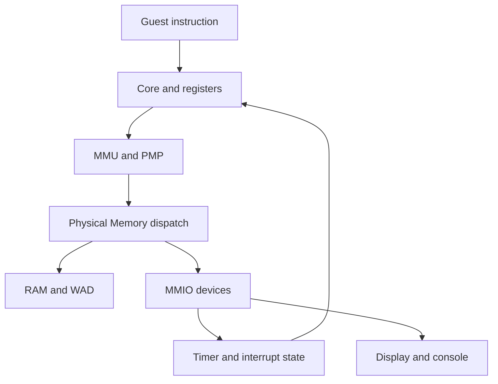
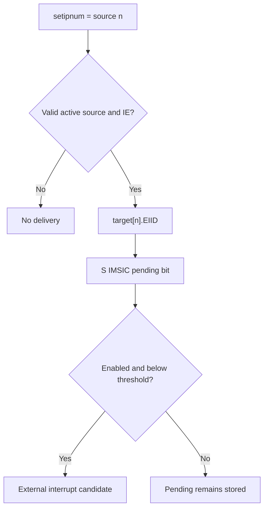

# DoomV devices and system architecture

Source baseline: `6b37ec0675cb052e4821c227a7b4c57af89b280f`.

Companions: [ISA/CSR reference](ISA_EXTENSIONS.md) · [boot walkthrough](BOOT_FLOW.md).

## Contents

- [System ownership and execution](#system-ownership-and-execution)
- [Physical memory map](#physical-memory-map)
- [MMIO bus and access widths](#mmio-bus-and-access-widths)
- [RAM WAD and loaders](#ram-wad-and-loaders)
- [MMU PMP and access faults](#mmu-pmp-and-access-faults)
- [Timer and local interrupts](#timer-and-local-interrupts)
- [APLIC: interrupt sources to message identities](#aplic-interrupt-sources-to-message-identities)
- [IMSIC: interrupt-file architecture](#imsic-interrupt-file-architecture)
- [Interrupt delivery through CSRs](#interrupt-delivery-through-csrs)
- [UART console](#uart-console)
- [DOOM display input and debug output](#doom-display-input-and-debug-output)
- [Debugger and architectural traps](#debugger-and-architectural-traps)
- [Snapshots GUI and concurrency](#snapshots-gui-and-concurrency)
- [Device tree versus implemented hardware](#device-tree-versus-implemented-hardware)
- [Repository architecture map](#repository-architecture-map)
- [Boundaries and verification](#boundaries-and-verification)

## System ownership and execution

[DoomSystem](../src/doom_system.hpp) owns the virtual machine's core state: `Registers`, `Memory`, `RiscvCore`, `Decoder`, `Debugger`, controls and GUI. The core executes architectural operations, the decoder interprets instruction bits, and Memory routes physical accesses. There is one simulated hart; the host CPU/render threads do not represent separate guest harts.

[Memory](../src/memory.hpp) owns a timer, M and S IMSIC files, an APLIC and UART. The APLIC holds a reference to the S IMSIC. Member declaration order matters: the S file must exist before constructing the APLIC reference. The connection is a direct C++ call, not a simulated packet bus with latency.

The diagram describes the ordinary core access route. Specialized H/vector paths sometimes call the MMU directly and bypass parts of the final wrapper; that distinction matters to checking coverage.

## Physical memory map

All ranges below are half-open: base is included, end is excluded. Values come from [memory.hpp](../src/memory.hpp), not from assumed QEMU addresses.

| Region | Base | Size | End | Owner/purpose |
|---|---|---|---|---|
| CLINT-compatible window | `0x02000000` | `0x10000` | `0x02010000` | Timer register subset |
| APLIC | `0x0C000000` | `0x4000` | `0x0C004000` | Source configuration and MSI forwarding |
| DOOM input | `0x10000000` | 4 | `0x10000004` | Pop a packed key event |
| DOOM tick | `0x10000004` | 4 | `0x10000008` | Scaled guest tick counter |
| DOOM debug | `0x10000008` | 4 | `0x1000000C` | Character output at first byte |
| UART | `0x10000100` | `0x100` | `0x10000200` | Polled byte register interface |
| Framebuffer | `0x10001000` | `0x3E800` | `0x1003F800` | 320×200×4 bytes |
| M IMSIC file | `0x24000000` | `0x1000` | `0x24001000` | M-target MSI doorbell |
| S IMSIC file | `0x28000000` | `0x1000` | `0x28001000` | S-target MSI doorbell |
| RAM | `0x80000000` | `0x10000000` | `0x90000000` | 256 MiB |
| WAD | `0x90000000` | `0x01400000` | `0x91400000` | 20-MiB asset window |

The framebuffer allocation is exactly 256,000 bytes, not a rounded 256-KiB backing region. RAM and WAD share one contiguous allocation. The device tree advertises only the RAM portion as ordinary Linux RAM.

## MMIO bus and access widths

MMIO means a CPU load/store reaches a device register because its translated physical address selects that device. A read can consume an event; a write can trigger delivery. These side effects make access width and address part of the interface, not an incidental implementation choice.

[memory.cpp](../src/memory.cpp) exposes byte, halfword, word and doubleword reads plus byte/word/doubleword writes. There is no separate write16 API; callers can compose two byte stores.

| Access method | Dispatch behavior |
|---|---|
| `read8` | Direct RAM/WAD, framebuffer or UART; otherwise zero |
| `read16` | Two little-endian byte reads |
| `read32` | Special input/tick/timer/APLIC/IMSIC handling, then RAM fast path or composed reads |
| `read64` | RAM fast path, otherwise two read32 calls |
| `write8` | RAM/WAD, framebuffer, first debug byte, UART |
| `write32` | Timer/APLIC/IMSIC handling before four byte writes |
| `write64` | Two write32 calls |

Thus a word write to an IMSIC doorbell calls `set_pending` once with the full identity; decomposing that into bytes would lose the command. Conversely, a byte read of DOOM input does not pop a key, because the pop is implemented in read32.

`is_backed(addr,size)` checks that an entire access lies inside a known region and detects wraparound. It is a region check, not full per-register validation: holes inside a device window can still read zero or ignore writes. The normal core wrapper raises an architectural access fault for an unbacked access; direct Memory calls themselves retain forgiving zero/ignored behavior.

For example an eight-byte access spanning two adjacent four-byte DOOM control registers fails the backing check, even though each word alone names a register. Not every specialized instruction currently supplies its full width to that check, which is documented as a limitation rather than generalized into an architectural guarantee.

RAM read fast paths use memcpy and the project assumes a little-endian host in relevant raw-layout paths. This is not a host-independent serialization layer.

## RAM WAD and loaders

RAM/WAD use one byte vector sized 276 MiB. Framebuffer uses a separate byte vector. No DRAM timings, refresh, banks or cache-coherence transactions are modeled.

`load_wad` copies bytes into the WAD slice. The bus also accepts writes there, so it is not enforced as read-only ROM. Its role as asset storage comes from software usage.

`load_elf` reads PT_LOAD segments using ELF structures chosen by runtime XLEN, places segments by p_vaddr and zeroes BSS tails. It does not discover XLEN from ELF class for dispatch, use e_entry for startup, implement relocations or dynamically link a program. It performs basic format/range checks, not hardened validation of every malformed ELF case.

`load_blob` copies a file at a specified physical address. The Linux path uses it for Image, DTB and initramfs. The loader checks allocation bounds but does not detect collisions with a different already-loaded artifact. See the [boot guide's placement table](BOOT_FLOW.md#linux-physical-image-placement).

## MMU PMP and access faults

The MMU is core architectural machinery rather than an MMIO device. [mmu.cpp](../src/mmu.cpp) converts effective addresses under Bare/Sv39 and, for explicit HLV/HSV accesses, guest first-stage plus Sv39x4 G-stage translation. Ordinary virtual execution is not automatically switched to that path: the normal wrapper leaves as_guest=false. `satp`, `vsatp` and `hgatp` are CSRs, not addresses in the device map.

PMP is a second permission layer on **physical** addresses. [pmp.cpp](../src/pmp.cpp) implements 16 entries with permissions, range modes and locks. A valid writable PTE does not override a read-only PMP region. The first-stage walker checks access to page tables themselves. This snapshot faults on clear A/D bits rather than updating them; the G-stage walker lacks equivalent PMP coverage.

The normal `translate_or_trap` path combines translation, actual physical backing and PMP access checks, using access type and width. MPRV changes effective privilege for M-mode data access, not for instruction fetch. Pointer masking transforms selected data addresses before translation; it is not a new physical device.

| Condition | Fault class | Typical handler interpretation |
|---|---|---|
| Invalid PTE, missing permission, bad canonical VA | Page fault 12/13/15 | Kernel can examine/fix virtual mapping |
| Unbacked physical address or PMP denial | Access fault 1/5/7 | Mapping alone cannot grant physical access |
| Guest second-stage translation failure | Guest-page fault 20/21/23 | Hypervisor examines guest physical backing |
| Illegal instruction/CSR access | Illegal instruction 2 | Handler may emulate, reject or terminate |
| Virtualized privileged operation requiring HS intervention | Virtual instruction 22 where implemented | Hypervisor can distinguish an intercept |

There is no TLB, so fences do not flush stored translations. There is a decode cache, but it validates instruction bytes and is not the same thing as a TLB or architectural instruction cache.

## Timer and local interrupts

[Timer](../src/timer.hpp) contains two 64-bit values: `mtime` and `mtimecmp`. Reset initializes both to zero, making the machine timer condition immediately true; interrupt enables are initially clear. `tick(count)` adds to mtime. No host wall-clock thread drives it.

| Timer-relative offset | Interface | Behavior |
|---|---|---|
| `0x4000` | mtimecmp low word | Read/write deadline low 32 bits |
| `0x4004` | mtimecmp high word | Read/write deadline high 32 bits |
| `0xBFF8` | mtime low word | Read live counter |
| `0xBFFC` | mtime high word | Read live counter high half |
| Other offsets | Unimplemented | Read zero, writes ignored |

The comparison is `mtime >= mtimecmp`. The timer is CLINT-compatible only in the implemented register subset: there is no live MMIO MSIP register, even though the DTS includes M-software interrupt metadata expected by firmware initialization. One hart avoids needing working cross-hart IPIs in the demonstrated boot path.

Sstc is implemented in CSR logic: `menvcfg.STCE` enables comparing the same mtime against `stimecmp`, contributing STIP. It is not a third independent clock. The unprivileged cycle/time/instret reads also alias mtime; they are not separately measured performance counters.

DOOM's tick register is different: `Memory::step_instructions` accumulates steps until 1,200 have elapsed, then increments a 32-bit millisecond-like count. Linux uses the DT timebase to interpret raw mtime instead. Neither interface measures host wall-clock milliseconds directly.

## APLIC: interrupt sources to message identities

APLIC means **Advanced Platform-Level Interrupt Controller**. Architecturally it accepts platform interrupt sources and routes them to harts, including MSI delivery to IMSIC. DoomV models one flat domain with sources 1–31; source 0 is reserved. It stores source modes and target fields, but has no general external pin/edge/level sampling API.

The implemented trigger is a software MMIO write to setipnum. [aplic.cpp](../src/aplic.cpp) checks that the source number is valid, sourcecfg is nonzero and domain delivery is enabled, then directly sets the target EIID pending in the S IMSIC object.

| Offset from `0x0C000000` | Register | Implemented behavior |
|---|---|---|
| `0x0000` | domaincfg | Stores IE bit 8, DM bit 2 and BE bit 0; read also sets bit 31 |
| `0x0004 + 4×(n−1)` | sourcecfg[n] | Stores low 3 source-mode bits for n=1…31 |
| `0x1CDC` | setipnum | Trigger selected source; reads zero |
| `0x3004 + 4×(n−1)` | target[n] | Stores target bits masked by `0xFFFFF7FF`; low 11 bits are EIID |
| Other offsets | Not modeled | Zero reads, ignored writes |

The source ID and EIID need not match. Source 5 can target identity 17. Sourcecfg must be nonzero and domain IE set for the trigger to forward. The current forwarding path does not enforce the stored DM bit; it always forwards to S IMSIC. It ignores Hart Index and Guest Index for routing and has no child-domain delegation, full enable/pending arrays, complete priority model or real big-endian mode despite storing BE.

The diagram's last stage also requires IMSIC global delivery enabled. Nothing connects UART RX to this source interface in the current machine.

## IMSIC: interrupt-file architecture

IMSIC means **Incoming MSI Controller**. An interrupt file keeps pending and enable bits for message identities. Receiving a message sets an identity pending; it does not necessarily trap immediately. Delivery also depends on file enable/threshold and hart-level interrupt controls.

There are separate M and S [Imsic objects](../src/imsic.hpp). The C++ representation allocates 64 words of 32 bits each, providing identity storage up to 2047, with zero reserved. The DTS advertises only 63 identities. This implementation uses consecutive selectors for 32-bit words even under RV64, which should not be confused with complete architectural RV64 indirect-window packing.

The physical page is the **message injection doorbell**. A 32-bit write to offset 0 (`seteipnum_le`) sets the supplied identity pending; page reads return zero and other writes are ignored. Enable/threshold/pending-file management uses indirect **CSRs**, not this MMIO page.

| Selector via miselect/siselect | File register | Behavior |
|---|---|---|
| `0x70` | eidelivery | Global delivery boolean |
| `0x72` | eithreshold | 0 means no threshold restriction; otherwise IDs must be less than threshold |
| `0x80`…`0xBF` | eip word array | Pending bits, one 32-bit host word per selector |
| `0xC0`…`0xFF` | eie word array | Enable bits, one 32-bit host word per selector |

`topei_value` searches increasing IDs for a pending AND enabled candidate passing threshold, provided eidelivery is true. It returns `(id << 16) | id`. This is the current priority representation, not an implementation of arbitrary priority programming. `claim` clears the current top candidate's pending bit. Pending messages can remain stored while disabled and become deliverable when enabled later.

The M file drives the machine external cause; the S file drives the supervisor external cause. H support in the CPU does not add guest IMSIC files: GEILEN remains zero in the modeled hypervisor state.

## Interrupt delivery through CSRs

An interrupt has several gates. A device condition or pending identity first contributes to effective `mip`; `mie` selects enabled causes. `mideleg` selects whether a cause targets supervisor level. The current mode and destination global-enable state determine whether the core takes a trap before the next instruction.

| Cause | Number / pending bit | Source in this model |
|---|---|---|
| Supervisor software | 1 | Software shadow |
| Machine software | 3 | Software shadow, not a working CLINT MSIP register |
| Supervisor timer | 5 | Shadow or Sstc comparison |
| Machine timer | 7 | mtime/mtimecmp comparison |
| Supervisor external | 9 | S IMSIC aggregate or software shadow |
| Machine external | 11 | M IMSIC aggregate |

`sie` is `mie & mideleg`; `sip` is effective `mip & mideleg`. These are aliases, not independent copies. `read_csr_effective` supplies computed views; directly reading generic CSR storage can show a different value.

`mtopi/stopi` identify the top pending enabled **local cause**. `mtopei/stopei` identify the top **external message** inside an interrupt file. Reading the latter is a peek. A CSR instruction that actually writes claims the external interrupt; `csrr` must not accidentally claim it by writing back an unchanged value.

Trap vectors are direct-only: mtvec/stvec/vstvec low MODE bits are cleared on writes. The handler receives saved PC and cause state, not a C++ callback from the device. It must clear/rearm the underlying condition; otherwise the next eligible step can take the interrupt again.

Sscofpmf has an overflow-state helper, but effective `compute_mip` in this snapshot does not connect it to LCOFI. Likewise the H CSR storage is not a complete virtual interrupt-injection implementation. See the [ISA limitations](ISA_EXTENSIONS.md).

## UART console

The [UART](../src/uart.cpp) is a small polled ns16550a-style register subset at `0x10000100`, with byte-spaced registers. It is sufficient for the documented firmware console usage, not a timing-accurate 16550.

| Offset | Name | Behavior |
|---|---|---|
| 0 | RBR on read / THR on write | Pop received byte / print and flush host stdout |
| 1 | IER | Stored byte; does not create an interrupt connection |
| 2 | FCR on write | Stored; reads return default zero, not complete IIR behavior |
| 3 | LCR | Stored; does not implement full line-control/DLAB behavior |
| 4 | MCR | Stored modem-control value |
| 5 | LSR | TEMT and THRE always set; DR set when RX ring nonempty |
| 6 | MSR | Zero |
| 7 | SCR | Scratch storage |

There is no baud-rate timing, serial bit stream, divisor-latch bank switching or TX FIFO scheduling. Writing offset zero immediately emits a character. UART register storage is not proof that every hardware function controlled by the bits exists.

In Linux mode the render/input thread translates SDL keypresses into console bytes and calls `push_rx`; releases are ignored. A mutex protects RX producer/consumer operations. The ring drops incoming bytes when full. Output goes to the host process's stdout, so the terminal and SDL window serve different roles.

## DOOM display input and debug output

The framebuffer is 320×200 32-bit pixels. The guest writes final pixels; the host does no emulated GPU shading or rasterization. Memory increments a write counter per framebuffer byte written. A dashboard rate derived from that count is not a hardware vblank counter or a record of atomic frame presentation.

The key queue has 16 slots with one slot reserved to distinguish full from empty, yielding 15 queued events. It stores `(pressed << 8) | doom_keycode`; a read32 at input pops one word. Host controls mapping comes from [controls.json](../controls.json) and [controls.cpp](../src/controls.cpp), supplemented by fixed special-key translations in DoomSystem. Full queues drop events.

The tick register supplies instruction-scaled timing. The debug register prints the byte written at its base address, allowing newlib `_write` to emit text. These custom interfaces are separate from the Linux UART and SBI path; naming the debug character sink a “UART” would overstate its protocol.

## Debugger and architectural traps

The [Debugger](../src/debugger.cpp) is a host inspection facility. It has PC breakpoints, halt state, crash dumps and signature extraction. It does **not** implement RISC-V Debug Module registers, DMI/JTAG transport, architectural debug CSRs or the GDB remote serial protocol.

`-break=<hex_pc>` adds a breakpoint. `-sig=<begin>:<end>` selects a physical range written to `signature.log` on halt, one 32-bit word as eight hex digits per line. Dumps are used by differential harnesses to compare guest-produced result data; they are not automatically instruction-by-instruction lockstep with RTL or another simulator.

`crash.log` includes PC, privilege, selected raw privileged CSRs, timer values, integer/FP/vector registers and a 4,096-entry instruction history. Raw `mip` shadow in a dump is not necessarily the current effective pending value. The live GUI CSR panel calls effective reads, so that difference is intentional in current paths.

Decoder-reported disabled/illegal instructions halt and preserve a pending illegal-instruction value. F9 requests resume; the CPU then enters the architectural illegal-instruction trap so guest firmware can process it. By contrast, an execution helper can call `raise_illegal_instruction` directly and enter the trap immediately, so not every illegal condition uses the same host halt path.

Guest EBREAK is an architectural breakpoint exception routed through trap entry. It is distinct from `-break` matching a host-maintained PC list. A host breakpoint stops before executing the instruction at that address. On resume the breakpoint remains suppressed while PC still equals that location, because the step code can query halt conditions twice. It rearms after PC moves elsewhere.

## Snapshots GUI and concurrency

The CPU thread owns the mutable core/register/device execution state and runs instruction bursts. The GUI thread polls input and renders. A mutex protects copying `shared_snapshot`, which contains framebuffer, selected register views, trace data and recent CSR information. Keyboard and UART RX queues have their own locks; resume requests use an atomic flag.

The snapshot is a copied observation, not a second machine state that executes independently. It displays only selected slices of state; for example the dashboard vector snapshot contains low portions, while crash dumps include full vector registers. Rendering old data between publications is expected.

When halted, the CPU still publishes snapshots and sleeps for 10 ms between checks, keeping the GUI responsive. The detached loop has no elaborate guest shutdown/device teardown lifecycle. Host burst size affects responsiveness and throughput, not an architectural instruction grouping rule.

## Device tree versus implemented hardware

The [DTS](../tools/linux/dts/doomv.dts) binds drivers to this address map. It does not instantiate devices: changing an address in DTS without changing Memory causes software and model to disagree.

Several deliberate or existing mismatches deserve explicit treatment:

- The CLINT node declares software-interrupt metadata, but the timer object has no live MMIO MSIP.
- IMSIC nodes advertise 63 IDs while C++ allocates much more storage.
- APLIC is a minimal source-trigger-to-S-file forwarder, not the complete register map implied by a generic controller name.
- UART is polled and has no interrupts property or modeled APLIC connection.
- V/H runtime opt-in does not dynamically alter the static DTS.
- The WAD window and custom DOOM devices are not normal Linux boot requirements.

These are reasons to explain the **implemented interface and tested guest configuration**, rather than claiming an interchangeable model of every board with similarly named devices.

## Repository architecture map

The superproject tree was inventoried, including binary artifacts and submodule pins. The following map groups all first-party functional areas; external dependency trees are not claimed as fully reviewed first-party code.

| Area | Files/directories | Responsibility |
|---|---|---|
| Entry and ownership | `src/main.cpp`, `src/doom_system.*` | CLI, boot choice, execution loop, input routing |
| ISA configuration | `src/extensions.*` | Defaults and permissive march parser |
| Decode | `src/riscv_decoder.*` | Classification, instruction fields, decode cache and dispatch |
| Architectural state | `src/registers.*`, `src/riscv_core.hpp` | Register storage, core APIs and reservation state |
| Scalar ISA | `src/extensions/ext_i/m/a/c/f/d*.cpp` | Base integer, multiply, atomics, compressed and FP |
| Additional ISA | `src/extensions/ext_z*.cpp` | Bit operations, hints, CSR access, cache operations, extra FP |
| Vector ISA | `src/extensions/ext_v*.cpp`, `ext_zvbb.cpp` | Vector configuration, memory, arithmetic, masks and permutations |
| Shared FP/state helpers | `ext_fp16.hpp`, `ext_fp_common.hpp`, `ext_softfloat.hpp`, `ext_xstate.hpp`, `ext_v_common.hpp` | Numeric conversions, flags and state enable/dirty utilities |
| Privileged features | `ext_h*`, `ext_sscofpmf*`, `ext_ssstateen*`, `ext_svinval.cpp`, `ext_zicsr.cpp` | H, traps, CSR-only extensions and fences |
| Addressing | `src/memory.*`, `src/mmu.*`, `src/pmp.*` | Physical bus, loaders, translations and protection |
| Devices | `src/timer.*`, `aplic.*`, `imsic.*`, `uart.*` | Timer, interrupt controllers and console |
| Host inspection | `src/debugger.*`, `gui.*`, `snapshot.hpp`, `controls.*` | Breakpoints, snapshots, rendering and keys |
| Bare-metal platform | `tools/doom/doombuild/` first-party files | Guest startup, linking, MMIO callbacks and libc/WAD adapters |
| Linux platform | `tools/linux/dts`, firmware script and Linux/rootfs READMEs | Hardware description and guest artifact build contracts |
| Architectural tests | `tools/verification/tests/archtest/` | Setup, reference generation and signature runs |
| Differential tests | `tools/verification/tests/differential/` | Privileged/vector assembly, result extraction and comparison |
| Reference tools | `tools/verification/simulators/` | Build/configuration support and pinned simulator submodules |
| Suite acquisition | `tools/verification/tests/suites/fetch.sh` | External test collection setup |
| History and integration | `README.md`, `PLAN.md`, `docs/BUGS.md`, Makefiles | Prior results, rationale and build dependencies |

The tracked SDL headers/import libraries, SDL2.dll, WAD, kernel ELF/Image, DTB and cpio are inputs/artifacts, not alternative device implementations. `.gitmodules` records external engine, firmware, kernel, BusyBox, reference simulator and test-suite boundaries.

## Boundaries and verification

This is a functional instruction interpreter with a small platform model. It has no pipeline timing, modeled caches/TLB, multi-hart fabric, DMA engine, PCIe root complex, GPU, disk controller, network adapter or standard hardware debug transport in the inspected first-party source. H changes CPU translation/privilege machinery; it does not supply a complete virtualized device platform.

The documentation was checked statically against source definitions and links. No device integration tests or guest boots were run for this documentation-only change. For a device verification plan, test the actual public interface: register-width side effects, reset values, enabled versus pending state, boundary accesses, queue overflow, claim behavior and trap conditions. Compare against a matched machine configuration rather than assuming another simulator has the same number of interrupt identities or optional features.
