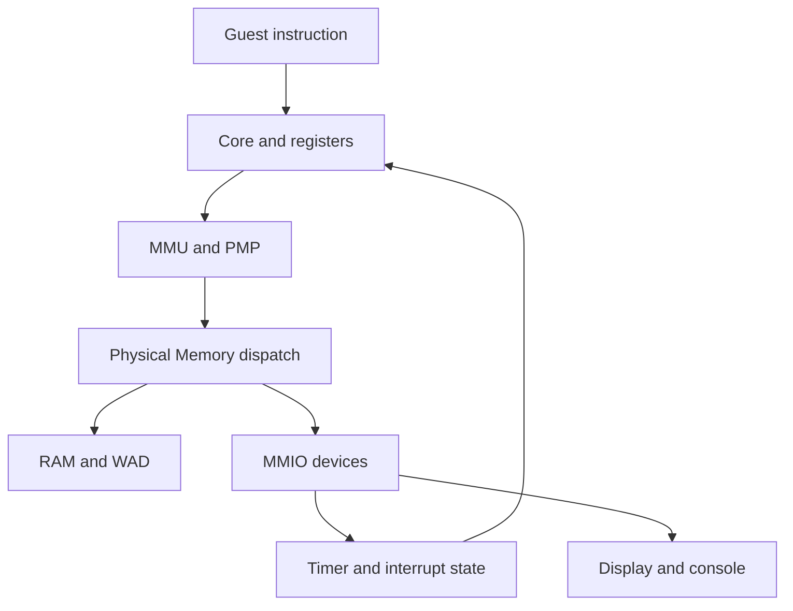
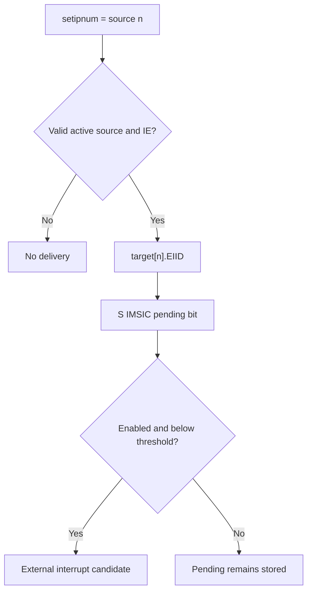

# DoomV devices and system architecture

Original inventory: `6b37ec0`. Translation, UART and debugger paths rechecked
at `c7d881b`. Address map, TLB, APLIC wiring, virtio devices, framebuffers,
input and GUI updated at `a1c7d20`; other register inventories retain their
original review scope.

[Documentation home](README.md) · [ISA reference](ISA_EXTENSIONS.md) · [Boot walkthrough](BOOT_FLOW.md)

Read this guide as a path through the machine: an instruction produces an
address, translation and protection decide whether it can be used, and the
physical bus selects RAM or a device. Interrupts travel back toward the core
through pending state and enable bits.

The address map is a lookup table. The worked examples explain how to use it.

## Contents

- [Worked example: one Sv39 load](#worked-example-one-sv39-load)
- [Worked example: polling the UART](#worked-example-polling-the-uart)
- [Why timer interrupts can prevent progress](#why-timer-interrupts-can-prevent-progress)
- [System ownership and execution](#system-ownership-and-execution)
- [Physical memory map](#physical-memory-map)
- [MMIO bus and access widths](#mmio-bus-and-access-widths)
- [RAM WAD and loaders](#ram-wad-and-loaders)
- [MMU PMP and access faults](#mmu-pmp-and-access-faults)
- [Timer and local interrupts](#timer-and-local-interrupts)
- [APLIC: interrupt sources to message identities](#aplic-interrupt-sources-to-message-identities)
- [IMSIC: interrupt-file architecture](#imsic-interrupt-file-architecture)
- [Interrupt delivery through CSRs](#interrupt-delivery-through-csrs)
- [UART console](#uart-console)
- [Virtio devices: disks, input and the shared folder](#virtio-devices-disks-input-and-the-shared-folder)
- [Linux framebuffer and power-off](#linux-framebuffer-and-power-off)
- [DOOM display input and debug output](#doom-display-input-and-debug-output)
- [Debugger and architectural traps](#debugger-and-architectural-traps)
- [Snapshots GUI and concurrency](#snapshots-gui-and-concurrency)
- [Device tree versus implemented hardware](#device-tree-versus-implemented-hardware)
- [Repository architecture map](#repository-architecture-map)
- [Boundaries and verification](#boundaries-and-verification)

## System ownership and execution

[DoomSystem](../src/doom_system.hpp) owns the virtual machine's core state: `Registers`, `Memory`, `RiscvCore`, `Decoder`, `Debugger`, controls and GUI. The core executes architectural operations, the decoder interprets instruction bits, and Memory routes physical accesses. There is one simulated hart; the host CPU/render threads do not represent separate guest harts.

[Memory](../src/memory.hpp) owns a timer, M and S IMSIC files, an APLIC, the UART, the virtio devices (root disk, eight drive slots, keyboard, mouse and the shared folder), both framebuffers and the power-off register. The APLIC holds a reference to the S IMSIC. Member declaration order matters: the S file must exist before constructing the APLIC reference. The connection is a direct C++ call, not a simulated packet bus with latency.

The diagram describes the ordinary core access route. Specialized H/vector paths sometimes call the MMU directly and bypass parts of the final wrapper; that distinction matters to checking coverage.

## Physical memory map

All ranges below are half-open: base is included, end is excluded. Values come from [memory.hpp](../src/memory.hpp), not from assumed QEMU addresses.

| Region | Base | Size | End | Owner/purpose |
|---|---|---|---|---|
| Test / power-off | `0x00100000` | `0x1000` | `0x00101000` | `sifive,test0`: `0x5555` powers off, `0x7777` reboots, `0x3333` fails |
| CLINT-compatible window | `0x02000000` | `0x10000` | `0x02010000` | Timer register subset |
| APLIC | `0x0C000000` | `0x4000` | `0x0C004000` | Source configuration and MSI forwarding |
| DOOM input | `0x10000000` | 4 | `0x10000004` | Pop a packed key event |
| DOOM tick | `0x10000004` | 4 | `0x10000008` | Scaled guest tick counter |
| DOOM debug | `0x10000008` | 4 | `0x1000000C` | Character output at first byte |
| DOOM mouse motion | `0x1000000C` | 4 | `0x10000010` | Motion accumulated since the last read; reading clears it |
| DOOM mouse buttons | `0x10000010` | 4 | `0x10000014` | Button state |
| DOOM WAD base and size | `0x10000014` | 8 | `0x1000001C` | Where the host loaded the WAD, and its length |
| UART | `0x10000100` | `0x100` | `0x10000200` | Polled byte register interface |
| Root disk (virtio-blk) | `0x10008000` | `0x1000` | `0x10009000` | `-disk=` image; APLIC source 1 |
| Keyboard (virtio-input) | `0x10100000` | `0x1000` | `0x10101000` | APLIC source 2 |
| Mouse (virtio-input) | `0x10101000` | `0x1000` | `0x10102000` | APLIC source 3 |
| Drive slots (8 × virtio-blk) | `0x10102000` | `0x8000` | `0x1010A000` | `drives/*.img`; APLIC sources 4–11 |
| Shared folder (virtio-9p) | `0x1010A000` | `0x1000` | `0x1010B000` | `shared/`; APLIC source 12 |
| DOOM framebuffer | `0x10200000` | `0x3E800` | `0x1023E800` | 320×200×4 bytes, past every virtio slot |
| M IMSIC file | `0x24000000` | `0x1000` | `0x24001000` | M-target MSI doorbell |
| S IMSIC file | `0x28000000` | `0x1000` | `0x28001000` | S-target MSI doorbell |
| Linux framebuffer | `0x50000000` | `0x4B4800` | `0x504B4800` | 1168×1056×4 bytes, `simple-framebuffer` |
| RAM | `0x80000000` | `0x40000000` | `0xC0000000` | 1 GiB |
| WAD | `0xC0000000` | `0x01400000` | `0xC1400000` | 20-MiB asset window |

The DOOM framebuffer allocation is exactly 256,000 bytes, not a rounded 256-KiB backing region. It sits past the virtio slots because the address decoders test ranges in different orders on the byte and word paths, so a device window overlapping it would silently take either pixels or register accesses; `Memory` has static assertions that nothing does. RAM and WAD share one contiguous allocation. The device tree advertises only the RAM portion as ordinary Linux RAM; the Linux framebuffer deliberately sits outside it, so the kernel never allocates over the aperture.

An empty drive slot is still a device window: it reads device ID 0, which the virtio-mmio driver skips. That is how the device tree can list all eight slots whether or not eight drives exist.

## MMIO bus and access widths

MMIO means a CPU load/store reaches a device register because its translated physical address selects that device. A read can consume an event; a write can trigger delivery. These side effects make access width and address part of the interface, not an incidental implementation choice.

[memory.cpp](../src/memory.cpp) exposes byte, halfword, word and doubleword reads plus byte/word/doubleword writes. There is no separate write16 API; callers can compose two byte stores.

| Access method | Dispatch behavior |
|---|---|
| `read8` | Direct RAM/WAD, either framebuffer, UART or a virtio config space; otherwise zero |
| `read16` | Two little-endian byte reads |
| `read32` | Special input/mouse/WAD/tick/timer/APLIC/IMSIC/virtio handling, then RAM and Linux-framebuffer fast paths or composed reads |
| `read64` | RAM fast path, otherwise two read32 calls |
| `write8` | RAM/WAD, either framebuffer, first debug byte, UART, virtio-input config selectors |
| `write32` | Timer/APLIC/IMSIC/virtio/power-off handling and the Linux-framebuffer fast path before four byte writes |
| `write64` | Two write32 calls |

Thus a word write to an IMSIC doorbell calls `set_pending` once with the full identity; decomposing that into bytes would lose the command. Conversely, a byte read of DOOM input does not pop a key, because the pop is implemented in read32.

A virtio `QueueNotify` store is the same kind of command. The device processes the queue inside that write32 call and raises its APLIC source before the store returns.

`is_backed(addr,size)` checks that an entire access lies inside a known region and detects wraparound. It is a region check, not full per-register validation: holes inside a device window can still read zero or ignore writes. The normal core wrapper raises an architectural access fault for an unbacked access; direct Memory calls themselves retain forgiving zero/ignored behavior.

For example an eight-byte access spanning two adjacent four-byte DOOM control registers fails the backing check, even though each word alone names a register. Not every specialized instruction currently supplies its full width to that check, which is documented as a limitation rather than generalized into an architectural guarantee.

RAM read fast paths use memcpy and the project assumes a little-endian host in relevant raw-layout paths. This is not a host-independent serialization layer.

## RAM WAD and loaders

RAM/WAD use one byte vector sized 1,044 MiB: 1 GiB of RAM plus the 20-MiB WAD window. Each framebuffer uses a separate byte vector. No DRAM timings, refresh, banks or cache-coherence transactions are modeled.

`load_wad` copies bytes into the WAD slice. The bus also accepts writes there, so it is not enforced as read-only ROM. Its role as asset storage comes from software usage. The DOOM guest asks for the window's address and length through `MMIO_WAD_BASE` and `MMIO_WAD_SIZE` instead of compiling them in, which is why growing RAM to 1 GiB did not move DOOM's assets out from under it.

`load_elf` reads PT_LOAD segments using ELF structures chosen by runtime XLEN, places segments by p_vaddr and zeroes BSS tails. It does not discover XLEN from ELF class for dispatch, use e_entry for startup, implement relocations or dynamically link a program. It performs basic format/range checks, not hardened validation of every malformed ELF case.

`load_blob` copies a file at a specified physical address. The Linux path uses it for Image, DTB and initramfs. The loader checks allocation bounds but does not detect collisions with a different already-loaded artifact. See the [boot guide's placement table](BOOT_FLOW.md#linux-physical-image-placement).

## MMU PMP and access faults

The MMU is core architectural machinery rather than an MMIO device. [mmu.cpp](../src/mmu.cpp) converts effective addresses under Bare/Sv39 and, for explicit HLV/HSV accesses, guest first-stage plus Sv39x4 G-stage translation. Ordinary virtual execution is not automatically switched to that path: the normal wrapper leaves as_guest=false. `satp`, `vsatp` and `hgatp` are CSRs, not addresses in the device map.

PMP is a second permission layer on **physical** addresses. [pmp.cpp](../src/pmp.cpp) implements 16 entries with permissions, range modes and locks. A valid writable PTE does not override a read-only PMP region. The first-stage walker checks access to page tables themselves. This snapshot faults on clear A/D bits rather than updating them; the G-stage walker lacks equivalent PMP coverage.

The normal `translate_or_trap` path combines translation, actual physical backing and PMP access checks, using access type and width. MPRV changes effective privilege for M-mode data access, not for instruction fetch. Pointer masking transforms selected data addresses before translation; it is not a new physical device.

| Condition | Fault class | Typical handler interpretation |
|---|---|---|
| Invalid PTE, missing permission, bad canonical VA | Page fault 12/13/15 | Kernel can examine/fix virtual mapping |
| Unbacked physical address or PMP denial | Access fault 1/5/7 | Mapping alone cannot grant physical access |
| Guest second-stage translation failure | Guest-page fault 20/21/23 | Hypervisor examines guest physical backing |
| Illegal instruction/CSR access | Illegal instruction 2 | Handler may emulate, reject or terminate |
| Virtualized privileged operation requiring HS intervention | Virtual instruction 22 where implemented | Hypervisor can distinguish an intercept |

There is a small direct-mapped TLB ([mmu.hpp](../src/mmu.hpp)). It caches only single-stage, non-virtualized, non-M-mode translations whose A and D bits were already set, so a hit can never skip a required fault; two-stage, HLV/HSV and everything under H re-walk every time. `sfence.vma`, `sinval.vma` and writes to the CSRs a walk depends on flush it wholesale. There is also a decode cache, but it validates instruction bytes and is not the same thing as a TLB or architectural instruction cache.

## Timer and local interrupts

[Timer](../src/timer.hpp) contains two 64-bit values: `mtime` and `mtimecmp`. Reset initializes both to zero, making the machine timer condition immediately true; interrupt enables are initially clear. `tick(count)` adds to mtime. No host wall-clock thread drives it: `DoomSystem::clock_tick` adds one every second step and on each tick of a `wfi` or `wrs` wait, which is Sail's clock with `instructions_per_tick` 2 and `max_time_to_wait` 10.

| Timer-relative offset | Interface | Behavior |
|---|---|---|
| `0x4000` | mtimecmp low word | Read/write deadline low 32 bits |
| `0x4004` | mtimecmp high word | Read/write deadline high 32 bits |
| `0xBFF8` | mtime low word | Read live counter |
| `0xBFFC` | mtime high word | Read live counter high half |
| Other offsets | Unimplemented | Read zero, writes ignored |

The comparison is `mtime >= mtimecmp`. The timer is CLINT-compatible only in the implemented register subset: there is no live MMIO MSIP register, even though the DTS includes M-software interrupt metadata expected by firmware initialization. One hart avoids needing working cross-hart IPIs in the demonstrated boot path.

Sstc is implemented in CSR logic: `menvcfg.STCE` enables comparing the same mtime against `stimecmp`, contributing STIP. It is not a third independent clock. The unprivileged cycle/time/instret reads return mcycle, mtime and minstret: mcycle counts clock ticks and minstret completed instructions, each subject to mcountinhibit and the Smcntrpmf filters in mcyclecfg and minstretcfg.

DOOM's tick register is different: `Memory::step_instructions` accumulates steps until 1,200 have elapsed, then increments a 32-bit millisecond-like count. Linux uses the DT timebase to interpret raw mtime instead. Neither interface measures host wall-clock milliseconds directly.

## APLIC: interrupt sources to message identities

APLIC means **Advanced Platform-Level Interrupt Controller**. Architecturally it accepts platform interrupt sources and routes them to harts, including MSI delivery to IMSIC. DoomV models one flat domain with sources 1–31; source 0 is reserved. It stores source modes and target fields, and does no edge or level sampling of its own.

A source becomes pending in one of two ways: a guest MMIO write to setipnum, or a device calling `Aplic::assert_source`. The second is the virtio devices' interrupt line, raised after a queue has been processed. Both share one forwarding path. [aplic.cpp](../src/aplic.cpp) checks that the source number is valid, sourcecfg is nonzero and domain delivery is enabled, then directly sets the target EIID pending in the S IMSIC object.

| Offset from `0x0C000000` | Register | Implemented behavior |
|---|---|---|
| `0x0000` | domaincfg | Stores IE bit 8, DM bit 2 and BE bit 0; read also sets bit 31 |
| `0x0004 + 4×(n−1)` | sourcecfg[n] | Stores low 3 source-mode bits for n=1…31 |
| `0x1CDC` | setipnum | Trigger selected source; reads zero |
| `0x3004 + 4×(n−1)` | target[n] | Stores target bits masked by `0xFFFFF7FF`; low 11 bits are EIID |
| Other offsets | Not modeled | Zero reads, ignored writes |

The source ID and EIID need not match. Source 5 can target identity 17. Sourcecfg must be nonzero and domain IE set for the trigger to forward. The current forwarding path does not enforce the stored DM bit; it always forwards to S IMSIC. It ignores Hart Index and Guest Index for routing and has no child-domain delegation, full enable/pending arrays, complete priority model or real big-endian mode despite storing BE.

The diagram's last stage also requires IMSIC global delivery enabled. The virtio devices use sources 1–12 (see the address map). The UART is still polled and has no source.

## IMSIC: interrupt-file architecture

IMSIC means **Incoming MSI Controller**. An interrupt file keeps pending and enable bits for message identities. Receiving a message sets an identity pending; it does not necessarily trap immediately. Delivery also depends on file enable/threshold and hart-level interrupt controls.

There are separate M and S [Imsic objects](../src/imsic.hpp). The C++ representation allocates 64 words of 32 bits each, providing identity storage up to 2047, with zero reserved. The DTS advertises only 63 identities. This implementation uses consecutive selectors for 32-bit words even under RV64, which should not be confused with complete architectural RV64 indirect-window packing.

The physical page is the **message injection doorbell**. A 32-bit write to offset 0 (`seteipnum_le`) sets the supplied identity pending; page reads return zero and other writes are ignored. Enable/threshold/pending-file management uses indirect **CSRs**, not this MMIO page.

| Selector via miselect/siselect | File register | Behavior |
|---|---|---|
| `0x70` | eidelivery | Global delivery boolean |
| `0x72` | eithreshold | 0 means no threshold restriction; otherwise IDs must be less than threshold |
| `0x80`…`0xBF` | eip word array | Pending bits, one 32-bit host word per selector |
| `0xC0`…`0xFF` | eie word array | Enable bits, one 32-bit host word per selector |

`topei_value` searches increasing IDs for a pending AND enabled candidate passing threshold, provided eidelivery is true. It returns `(id << 16) | id`. This is the current priority representation, not an implementation of arbitrary priority programming. `claim` clears the current top candidate's pending bit. Pending messages can remain stored while disabled and become deliverable when enabled later.

The M file drives the machine external cause; the S file drives the supervisor external cause. H support in the CPU does not add guest IMSIC files. GEILEN is 63, matching the Sail configuration DoomV is held to, so `hgeie` holds 63 enables and `mideleg` bit 12 is read-only one, but no device raises a guest external interrupt and `hgeip` reads zero.

## Interrupt delivery through CSRs

An interrupt has several gates. A device condition or pending identity first contributes to effective `mip`; `mie` selects enabled causes. `mideleg` selects whether a cause targets supervisor level. The current mode and destination global-enable state determine whether the core takes a trap before the next instruction.

| Cause | Number / pending bit | Source in this model |
|---|---|---|
| Supervisor software | 1 | Software shadow |
| Machine software | 3 | Software shadow, not a working CLINT MSIP register |
| Supervisor timer | 5 | Shadow or Sstc comparison |
| Machine timer | 7 | mtime/mtimecmp comparison |
| Supervisor external | 9 | S IMSIC aggregate or software shadow |
| Machine external | 11 | M IMSIC aggregate |

`sie` is `mie & mideleg`; `sip` is effective `mip & mideleg`. These are aliases, not independent copies. `read_csr_effective` supplies computed views; directly reading generic CSR storage can show a different value.

`mtopi/stopi` identify the top pending enabled **local cause**. `mtopei/stopei` identify the top **external message** inside an interrupt file. Reading the latter is a peek. A CSR instruction that actually writes claims the external interrupt; `csrr` must not accidentally claim it by writing back an unchanged value.

Trap vectors support direct and vectored mode: in vectored mode (MODE 1) of mtvec/stvec/vstvec an interrupt goes to base + 4 × cause and an exception to the base; a write of a reserved MODE keeps the previous mode. The handler receives saved PC and cause state, not a C++ callback from the device. It must clear/rearm the underlying condition; otherwise the next eligible step can take the interrupt again.

Sscofpmf has an overflow-state helper, but effective `compute_mip` in this snapshot does not connect it to LCOFI. Likewise the H CSR storage is not a complete virtual interrupt-injection implementation. See the [ISA limitations](ISA_EXTENSIONS.md).

## UART console

The [UART](../src/uart.cpp) is a small polled ns16550a-style register subset at `0x10000100`, with byte-spaced registers. It is sufficient for the documented firmware console usage, not a timing-accurate 16550.

| Offset | Name | Behavior |
|---|---|---|
| 0 | RBR on read / THR on write | Pop received byte / queue the byte for host stdout |
| 1 | IER | Stored byte; does not create an interrupt connection |
| 2 | FCR on write | Stored; reads return default zero, not complete IIR behavior |
| 3 | LCR | Stored; does not implement full line-control/DLAB behavior |
| 4 | MCR | Stored modem-control value |
| 5 | LSR | TEMT and THRE always set; DR set when RX ring nonempty |
| 6 | MSR | Zero |
| 7 | SCR | Scratch storage |

There is no baud-rate timing, serial bit stream, divisor-latch bank switching or TX FIFO scheduling. Writing offset zero hands the character to a console output thread, which writes queued bytes to stdout in order and in batches; the guest cannot observe when that happens, since the transmitter always reads as empty. UART register storage is not proof that every hardware function controlled by the bits exists.

In Linux mode each keypress goes two places. The virtio keyboard receives it as an evdev key event, which is what the framebuffer console on tty0 and X read. The same press is also translated into console bytes for `push_rx`, with typed text arriving as SDL text input, so the SBI console on hvc0 can be driven from the window too. A mutex protects RX producer/consumer operations. From the GUI, the ring drops incoming bytes when full. The headless stdin feed (`-ng`) waits for room instead, and `-expect=` holds that feed back until the guest has printed a given string. Output goes to the host process's stdout, so the terminal and SDL window serve different roles.

## Virtio devices: disks, input and the shared folder

Every device a distribution needs beyond the console is virtio over MMIO, version 2 (the non-legacy transport). Each has a 4-KiB register window with the standard layout, split virtqueues of up to 256 entries, and one APLIC source. The guest builds descriptor tables in its own RAM. On `QueueNotify` the device walks them, reads and writes guest memory directly, updates the used ring and asserts its source. There is no DMA timing: the whole request completes inside the store that announced it.

| Device | Implementation | Device ID | Queues | Backing |
|---|---|---|---|---|
| Root disk | [virtio_blk.cpp](../src/virtio_blk.cpp) | 2, or 0 without `-disk` | 1 | The `-disk=` image |
| Drive slots 0–7 | Same class | 2, or 0 when empty | 1 | `drives/*.img` in name order, at most eight; a read-only drive sets `VIRTIO_BLK_F_RO` |
| Keyboard, mouse | [virtio_input.cpp](../src/virtio_input.cpp) | 18 | 2 (eventq, statusq) | SDL events, or a `-input=` replay script |
| Shared folder | [virtio_9p.cpp](../src/virtio_9p.cpp) | 9 | 1 | `shared/` on the host, mount tag `shared` |

A block request is a header, data buffers and a status byte, in 512-byte sectors. The root disk and the drives are one class at different addresses and sources, so the drives enumerate after the root disk as further `/dev/vd*` devices.

virtio-input answers the config-space select/subsel queries the Linux driver uses to learn a device's name and which event types and codes it sends. SDL scancodes map to evdev key codes. The pointer is absolute: its position over the display becomes `ABS_X`/`ABS_Y` in framebuffer pixels, with the range (0–1167 by 0–1055) answered through `CFG_ABS_INFO`, so the guest cursor sits under the host pointer. The wheels stay relative, and the buttons map to `BTN_LEFT`, `BTN_RIGHT` and `BTN_MIDDLE`. Only events over the display area are forwarded. The window thread only submits events. The CPU thread commits them to the device -- and `pump_input` delivers them -- at instruction counts that are multiples of 4,096 (`DoomSystem::service_input`), so when the guest sees an input depends on the instruction count alone; `-record` and `-replay` log and reproduce those commits.

The 9P device is a 9P2000.L file server running inside the emulator. Requests are gathered from all of a request's readable descriptors and replies laid across its writable ones, which is what the Linux client's zero-copy reads and writes require. The server uses Windows wide-character APIs with extended-length paths and returns Linux errno values. It resolves the final path of every handle it opens and refuses anything outside the shared folder, including through links. Changes on either side are visible to the other immediately, because there is no cache to synchronize. Guest-visible metadata never comes from host state: timestamps for anything the guest changes are 2024-01-01 plus the instruction count as nanoseconds (and are written to the host file), access and change times equal the modification time, inode numbers are assigned in the order the guest first sees each file, listings are sorted by name, and `statfs` reports a fixed 1 TiB.

## Linux framebuffer and power-off

A Linux guest gets a second framebuffer: a 1168×1056, 32-bit linear aperture at `0x50000000`, described by a `simple-framebuffer` node. The kernel's simplefb driver trusts the node's width, height, stride and format completely, so [doomv.dts](../tools/linux/dts/doomv.dts) and `Memory::LFB_W`/`LFB_H` must agree, and nothing checks that they do. fbcon draws a 146×66 character console into it. The X desktops use the same aperture through Xorg's fbdev driver.

The `sifive,test0` register at `0x00100000` is how a guest stops the machine. OpenSBI's generic platform implements SBI system reset through it, so a guest `poweroff`, or `echo o > /proc/sysrq-trigger`, ends in a 32-bit store of `0x5555`. Memory records the request; the CPU loop checks it, writes any `-fbdump` image and ends the run. `0x7777` (reboot) and `0x3333` (fail) currently stop the run the same way.

## DOOM display input and debug output

The framebuffer is 320×200 32-bit pixels. The guest writes final pixels; the host does no emulated GPU shading or rasterization. Memory increments a write counter per framebuffer byte written. A dashboard rate derived from that count is not a hardware vblank counter or a record of atomic frame presentation.

The key queue has 16 slots with one slot reserved to distinguish full from empty, yielding 15 queued events. It stores `(pressed << 8) | doom_keycode`; a read32 at input pops one word. Host controls mapping comes from [controls.json](../controls.json) and [controls.cpp](../src/controls.cpp), supplemented by fixed special-key translations in DoomSystem. Full queues drop events.

The mouse uses two more registers. Motion accumulates between reads of `0x1000000C`, and a read returns it and clears it; `0x10000010` reports the buttons. The guest turns them into DOOM's `ev_mouse`, so mouse look and fire follow DOOM's own defaults rather than `controls.json`. Ctrl+Alt+G captures the host pointer, fenced inside the display area, and switches to deltas so it has no edge to stop at.

The tick register supplies instruction-scaled timing. The debug register prints the byte written at its base address, allowing newlib `_write` to emit text. These custom interfaces are separate from the Linux UART and SBI path; naming the debug character sink a “UART” would overstate its protocol.

## Debugger and architectural traps

The [Debugger](../src/debugger.cpp) is a host inspection facility. It has PC breakpoints, halt state, crash dumps and signature extraction. It does **not** implement RISC-V Debug Module registers, DMI/JTAG transport, architectural debug CSRs or the GDB remote serial protocol.

`-trace=<path>` writes a trace of every instruction and trap in Sail's trace format, and `-lockstep=<path>` runs the machine against a reference trace -- Sail's, the golden reference -- halting with a report and `crash.log` at the first record that differs; `-lockstep-strict` compares everything and takes nothing from the reference; see [lockstep.cpp](../src/lockstep.cpp) for what is compared in each mode, and `tools/verification/lockstep_sail.py` for the riscv-tests run strictly against Sail with its unmodified configuration. `-break=<hex_pc>` adds a breakpoint. `-sig=<begin>:<end>` selects a physical range written to `signature.log` on halt, one 32-bit word as eight hex digits per line. Dumps are used by differential harnesses to compare guest-produced result data; they are not automatically instruction-by-instruction lockstep with RTL or another simulator.

`crash.log` includes PC, privilege, selected raw privileged CSRs, timer values, integer/FP/vector registers and a 4,096-entry instruction history. Raw `mip` shadow in a dump is not necessarily the current effective pending value. The live GUI CSR panel calls effective reads, so that difference is intentional in current paths.

Decoder-reported disabled or illegal instructions normally enter the guest's
architectural illegal-instruction handler. This allows firmware probes and
tests to deliberately execute an invalid instruction and recover.

`Debugger::should_halt` retains an optional `break_on_illegal` path. If that
path is enabled, DoomV stops first and preserves the pending instruction
value. F9 requests resume, after which the guest receives the trap. An
execution helper may also raise the architectural exception directly. See
[DoomSystem::step](../src/doom_system.cpp) and
[Debugger::should_halt](../src/debugger.cpp).

## Worked example: one Sv39 load

Suppose S-mode code executes `ld a0, 0(a1)` with `a1 = 0x40001234`, Sv39
enabled, and a valid readable mapping to physical page `0x80005000`.
This is a worked example, not an address taken from a boot trace.

Sv39 divides the virtual address into three 9-bit page-table indices and a
12-bit byte offset. With 8-byte PTEs, each index selects one of 512 entries:

| Part | Value in this example | How it is used |
|---|---|---|
| VPN[2], bits 38:30 | `1` | Select the root-table entry |
| VPN[1], bits 29:21 | `0` | Select the next-level entry |
| VPN[0], bits 20:12 | `1` | Select the final entry for a 4-KiB page |
| Offset, bits 11:0 | `0x234` | Select bytes within the mapped physical page |

The root address comes from `satp.PPN << 12`. For a three-level mapping,
the first lookup is at `root + 1 * 8`. A non-leaf entry supplies the next
table's physical page number. After reaching the leaf, translation combines
`0x80005000` with `0x234`, yielding `0x80005234`.

Reaching a leaf is only part of success. The walker checks validity and
permissions; this implementation also requires the accessed bit and, for
stores, the dirty bit. Physical backing and PMP can still deny the resulting
access. Page-table reads themselves can fail before any leaf is reached.
See [mmu.cpp](../src/mmu.cpp) and [pmp.cpp](../src/pmp.cpp).

For this load, an invalid PTE produces cause 13 (load page fault), whereas
denied physical access produces cause 5 (load access fault). The distinction
tells the handler whether changing the virtual mapping is likely to help.
The architectural background is the [RISC-V supervisor specification](https://docs.riscv.org/reference/isa/priv/supervisor.html).

## Worked example: polling the UART

A read of UART line status at `0x10000105` observes bit 0 (`DR`) when the
receive queue contains data. A subsequent byte read at `0x10000100` removes
one character. Repeatedly reading the data register is therefore a state
change; it is not a harmless inspection of a stored RAM byte.

The reverse direction never waits: writing a byte at `0x10000100` queues it
for the console output thread, which writes it to stdout. There is no
simulated baud-rate delay. The
transmitter-empty bits are always set, and storing an interrupt-enable value
does not create an interrupt connection.

This explains two debugging traps. A memory dump that reads a device can
consume input, and a realistic-looking UART register value does not prove
that all 16550 behavior exists. Check the dispatch and side effects in
[memory.cpp](../src/memory.cpp) and [uart.cpp](../src/uart.cpp).

## Why timer interrupts can prevent progress

There are three separate quantities: host elapsed time, modeled timer ticks,
and the frequency reported in the device tree. DoomV advances its timer with
modeled execution; Linux uses the reported frequency to calculate deadlines.

For a periodic rate of 250 Hz, the reported 500-MHz timebase gives
`500,000,000 / 250 = 2,000,000` timer increments per interval -- four million
instructions, since mtime advances every second one. That says how the guest
interprets a counter, not how fast the host computes instructions.

If servicing a tick consumes more modeled increments than the interval,
the next deadline can already be overdue when the handler returns. The core
can keep executing instructions while useful kernel work stalls. Inspect
`mtime`, the active compare register, interrupt enables and the repeated PC
together; a changing instruction count alone does not prove progress.
See [timer.cpp](../src/timer.cpp), the
[device-tree timebase](../tools/linux/dts/doomv.dts), and
[interrupt handling](../src/extensions/ext_zicsr.cpp).

Guest EBREAK is an architectural breakpoint exception routed through trap entry. It is distinct from `-break` matching a host-maintained PC list. A host breakpoint stops before executing the instruction at that address. On resume the breakpoint remains suppressed while PC still equals that location, because the step code can query halt conditions twice. It rearms after PC moves elsewhere.

## Snapshots GUI and concurrency

The CPU thread owns the mutable core/register/device execution state and runs instruction bursts. Three more threads handle the window. The **display thread** copies whole frames out of the guest framebuffer: Memory keeps a write-generation counter per framebuffer, and the thread copies only once the counter has been still for 12 ms, discarding a copy that a write landed in; a guest that never pauses gets its frame shown every 500 ms. The **dashboard thread** draws the panels from `shared_snapshot`, which the CPU thread publishes under a mutex after each burst and which holds selected register views, trace data and CSR values but no pixels. The **window thread** polls SDL input and composites the two layers when either has changed. The layers meet the window at two buffer swaps under two small locks. Keyboard and UART RX queues have their own locks; resume requests use an atomic flag.

The snapshot is a copied observation, not a second machine state that executes independently. It displays only selected slices of state; for example the dashboard vector snapshot contains low portions, while crash dumps include full vector registers. Rendering old data between publications is expected.

`run()` gives the window the guest's display size and publishes one snapshot before the CPU thread starts, so the first frame is already laid out for the guest. In a window of at least 1920×1080 every guest gets the same compact layout. The display sits on the left at the Linux framebuffer's size, with DOOM scaled into it. Beside it are the CSR panel, the register file, the trace log and the pause banner, with equal margins all round. Smaller windows fall back to an older scaled layout. The CSR panel shows the ten CSRs used most across the last 1,024 CSR accesses (`Registers::top_csrs`), not every CSR the guest has ever touched.

When halted, the CPU still publishes snapshots and sleeps for 10 ms between checks, keeping the GUI responsive. The detached loop has no elaborate guest shutdown/device teardown lifecycle. Host burst size affects responsiveness and throughput, not an architectural instruction grouping rule.

## Device tree versus implemented hardware

The [DTS](../tools/linux/dts/doomv.dts) binds drivers to this address map. It does not instantiate devices: changing an address in DTS without changing Memory causes software and model to disagree.

Several deliberate or existing mismatches deserve explicit treatment:

- The CLINT node declares software-interrupt metadata, but the timer object has no live MMIO MSIP.
- IMSIC nodes advertise 63 IDs while C++ allocates much more storage.
- APLIC is a minimal source-trigger-to-S-file forwarder, not the complete register map implied by a generic controller name.
- UART is polled and has no interrupts property or modeled APLIC connection.
- V/H runtime opt-in does not dynamically alter the static DTS.
- The WAD window and custom DOOM devices are not normal Linux boot requirements.
- The `simple-framebuffer` geometry is copied by hand from `Memory::LFB_*`.
- All eight drive slots are listed whether or not a drive is attached; an empty slot reports device ID 0.

These are reasons to explain the **implemented interface and tested guest configuration**, rather than claiming an interchangeable model of every board with similarly named devices.

## Repository architecture map

The superproject tree was inventoried, including binary artifacts and submodule pins. The following map groups all first-party functional areas; external dependency trees are not claimed as fully reviewed first-party code.

| Area | Files/directories | Responsibility |
|---|---|---|
| Entry and ownership | `src/main.cpp`, `src/doom_system.*` | CLI, boot choice, execution loop, input routing |
| ISA configuration | `src/extensions.*` | Defaults and permissive march parser |
| Decode | `src/riscv_decoder.*` | Classification, instruction fields, decode cache and dispatch |
| Architectural state | `src/registers.*`, `src/riscv_core.hpp` | Register storage, core APIs and reservation state |
| Scalar ISA | `src/extensions/ext_i/m/a/c/f/d*.cpp` | Base integer, multiply, atomics, compressed and FP |
| Additional ISA | `src/extensions/ext_z*.cpp` | Bit operations, hints, CSR access, cache operations, extra FP |
| Vector ISA | `src/extensions/ext_v*.cpp`, `ext_zvbb.cpp` | Vector configuration, memory, arithmetic, masks and permutations |
| Shared FP/state helpers | `ext_fp16.hpp`, `ext_fp_common.hpp`, `ext_softfloat.hpp`, `ext_xstate.hpp`, `ext_v_common.hpp` | Numeric conversions, flags and state enable/dirty utilities |
| Privileged features | `ext_h*`, `ext_sscofpmf*`, `ext_ssstateen*`, `ext_svinval.cpp`, `ext_zicsr.cpp` | H, traps, CSR-only extensions and fences |
| Addressing | `src/memory.*`, `src/mmu.*`, `src/pmp.*` | Physical bus, loaders, translations and protection |
| Devices | `src/timer.*`, `aplic.*`, `imsic.*`, `uart.*`, `virtio_blk.*`, `virtio_input.*`, `virtio_9p.*` | Timer, interrupt controllers, console, disks, keyboard and mouse, shared folder |
| Host inspection | `src/debugger.*`, `gui.*`, `snapshot.hpp`, `controls.*` | Breakpoints, snapshots, rendering and keys |
| Bare-metal platform | `tools/doom/doombuild/` first-party files | Guest startup, linking, MMIO callbacks and libc/WAD adapters |
| Linux platform | `tools/linux/dts`, `tools/linux/ubuntu/`, `scripts/build_linux.sh`, `scripts/prepare_dtb.py` | Hardware description; kernel, BusyBox and Ubuntu build contracts |
| Host folders | `drives/`, `shared/`, `scripts/mkdrive.py` | Storage drive images and the live shared folder |
| Architectural tests | `tools/verification/tests/archtest/` | Setup, reference generation and signature runs |
| Differential tests | `tools/verification/tests/differential/` | Privileged/vector assembly, result extraction and comparison |
| Reference tools | `tools/verification/simulators/` | Build/configuration support and pinned simulator submodules |
| Suite acquisition | `tools/verification/tests/suites/fetch.sh` | External test collection setup |
| History and integration | `README.md`, `PLAN.md`, `docs/BUGS.md`, Makefiles | Prior results, rationale and build dependencies |

The tracked SDL headers/import libraries, SDL2.dll, WAD, kernel ELF/Image, DTB and cpio are inputs/artifacts, not alternative device implementations. `.gitmodules` records external engine, firmware, kernel, BusyBox, reference simulator and test-suite boundaries.

## Boundaries and verification

This is a functional instruction interpreter with a small platform model. It has no pipeline timing, modeled caches, multi-hart fabric, PCIe root complex, GPU, network adapter or standard hardware debug transport. Its disks, input devices and shared folder are paravirtual virtio devices that complete each request instantly, not models of real controllers, and its TLB is a host-speed cache rather than a modeled hardware structure. H changes CPU translation/privilege machinery; it does not supply a complete virtualized device platform.

The address map and device sections were checked against source at `a1c7d20`, and every regression suite passed after the last device change (`5ba6f40`). A documentation review is not itself a boot or a device test. For a device verification plan, test the actual public interface: register-width side effects, reset values, enabled versus pending state, boundary accesses, queue overflow, claim behavior and trap conditions. Compare against a matched machine configuration rather than assuming another simulator has the same number of interrupt identities or optional features.
